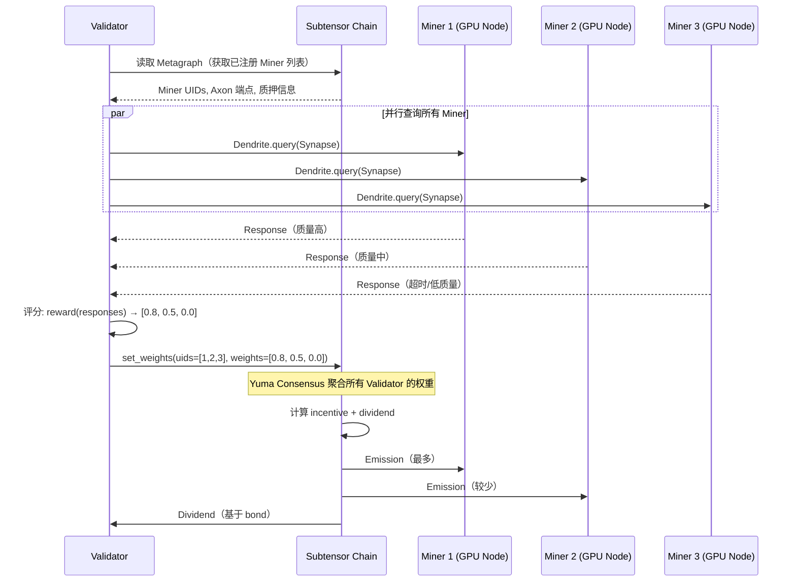
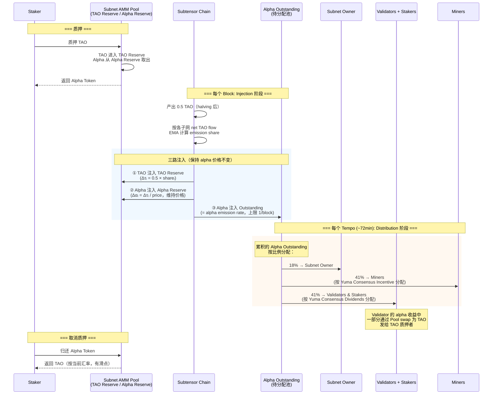
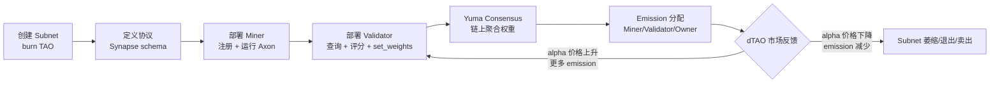
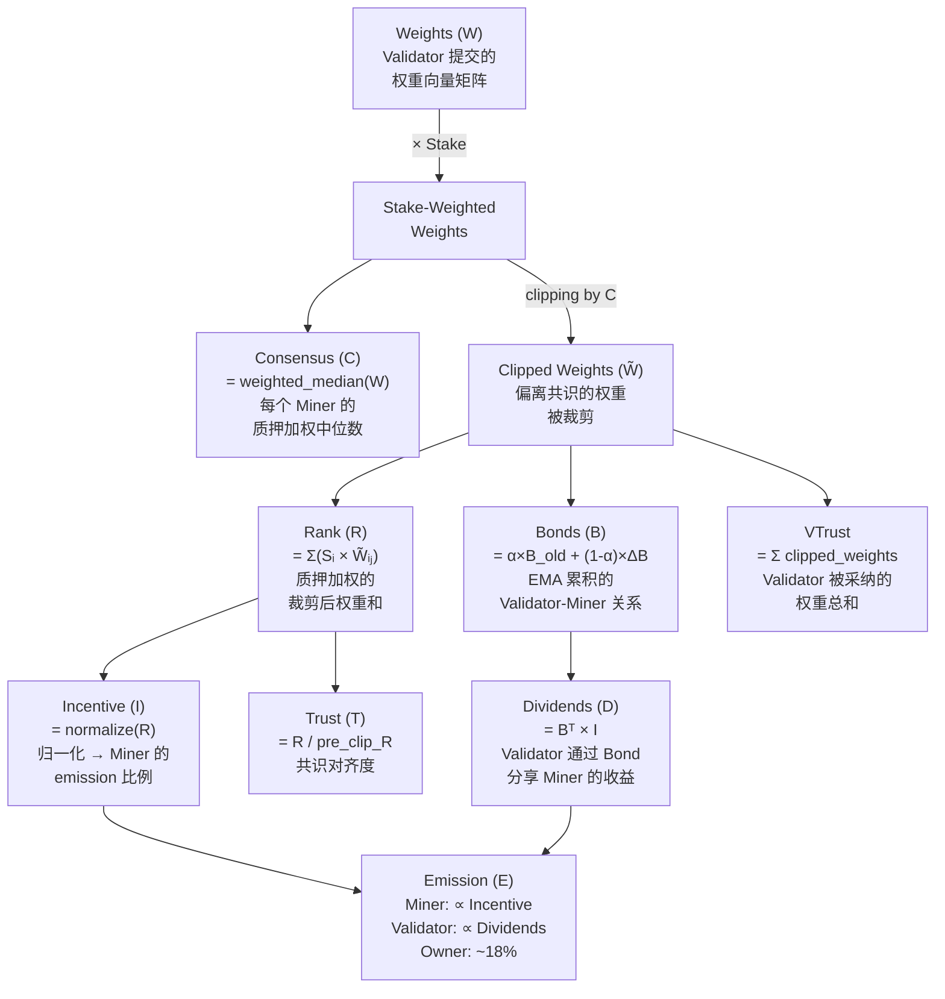
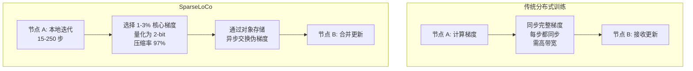
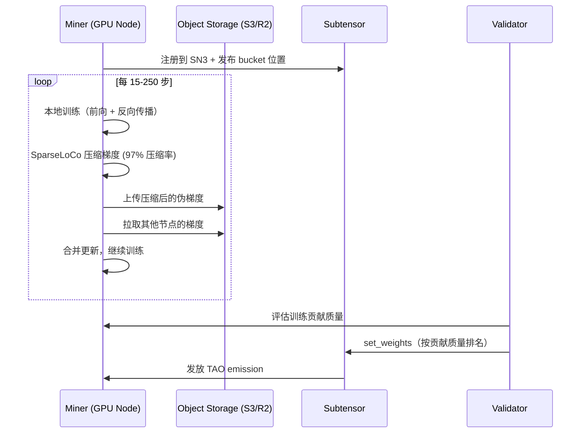

# Bittensor 技术调研与分享

## 目录

1. [概述](#1-概述)
2. [端到端流程](#2-端到端流程)
3. [网络架构](#3-网络架构)
4. [核心概念](#4-核心概念)
5. [Metagraph 参数详解](#5-metagraph-参数详解)
6. [Yuma Consensus 机制](#6-yuma-consensus-机制)
7. [深入案例：SN3 Templar 与 Covenant-72B](#7-深入案例sn3-templar-与-covenant-72b)
8. [Subnet 开发](#8-subnet-开发)
9. [技术栈与工具链](#9-技术栈与工具链)
10. [激励机制与奖励计算](#10-激励机制与奖励计算)
11. [其他关键 Subnet](#11-其他关键-subnet)
12. [Dynamic TAO (dTAO)](#12-dynamic-tao-dtao)
13. [代币经济学](#13-代币经济学)
14. [与其他去中心化 AI 项目对比](#14-与其他去中心化-ai-项目对比)
15. [挑战与风险](#15-挑战与风险)
16. [Demo 设计方案](#17-demo-设计方案)

---

## 1. 概述

Bittensor 是一个**去中心化 AI 网络**，核心目标是创建一个开放的、激励驱动的 AI 智能市场。与传统的去中心化计算网络（如 Akash、Render）不同，Bittensor 不仅仅出租 GPU 算力，而是**评估 AI 输出的质量**并奖励产出最优智能的参与者。

核心愿景：让 AI 模型的训练和推理去中心化，通过经济激励让全球参与者协作构建更好的 AI。

**它真的在工作吗？** 2026 年 3 月，Bittensor SN3 (Templar) 完成了 **Covenant-72B** —— 史上最大的去中心化 LLM 预训练，72B 参数、1.1 万亿 token、70+ 节点无许可参与。NVIDIA CEO 黄仁勋将其比作"现代版 Folding@home"。

---

## 2. 网络架构

### 区块链层：Subtensor

Bittensor 的链上层称为 **Subtensor**，是一条基于 **Substrate** (Parity 的 Rust 区块链框架) 构建的独立链。

- **语言**: Rust
- **框架**: Substrate FRAME
- **出块时间**: ~12 秒
- **非 Polkadot 平行链**，运行独立共识和验证者集合
- **核心 pallets**: 神经元注册、质押/委托、Subnet 管理、Yuma Consensus、TAO 代币经济
- **仓库**: [github.com/opentensor/subtensor](https://github.com/opentensor/subtensor)

### 网络拓扑

> 演讲时打开 [taostats.io/subnets](https://taostats.io/subnets) 直接看全部子网列表

网络由多个 **Subnet（子网）** 组成，每个子网是一个独立的、激励驱动的 AI 任务市场：

```
┌──────────────────────────────────────────────────────────┐
│                    Subtensor Chain                       │
│         (注册、质押、共识、emission 分配)                  │
├────────────┬────────────┬─────────────┬──────────────────┤
│  Subnet 1  │  Subnet 3  │  Subnet 9   │  Subnet N ...    │
│ （LLM 推理）│ （去中心化  │（模型预训练）│                  │
│            │   训练）   │             │                  │
│  Miners    │  Miners    │  Miners     │  Miners          │
│  Validators│  Validators│  Validators │  Validators      │
└────────────┴────────────┴─────────────┴──────────────────┘
```

子网内部通信遵循神经科学隐喻：

- **Axon**（轴突）：Miner 的服务端点，接收请求并返回结果
- **Dendrite**（树突）：Validator 的客户端，向 Miner 发送查询
- **Synapse**（突触）：请求/响应的消息格式
- **Metagraph**：跟踪子网内所有神经元状态的共享数据结构

> 演讲时用 btcli 直接查看：`btcli subnet list` 列出所有活跃子网

---

## 3. 端到端流程

### Subnet 内 Miner-Validator 交互流程

> 以 SN3 (Templar) 为例：Miner 提交训练好的模型梯度，Validator 评估训练贡献质量



### dTAO 质押与 Emission 流程

> Emission 是**两阶段**过程：先是每个 block 的 **Injection**（注入流动性到子网池），再是每个 tempo (~360 blocks) 的 **Distribution**（分配给参与者）



### Emission 注入的关键细节

**Q: 每个 block 产出的 0.5 TAO 如何在子网间分配？**

当前使用 **Flow-Based Model**（2025.11 上线，替代了之前的 price-based model）：

```
1. 跟踪每个子网的 net TAO flow：
   net_flow = Σ(TAO staked) - Σ(TAO unstaked)

2. 计算 EMA（86.8 天窗口，30 天半衰期）：
   S_i = (1-α) × S_{i-1} + α × net_flow_i    (α ≈ 0.000003209)

3. 裁剪负值 + 归一化：
   z_i = max(S_i - L, 0)
   share_i = z_i^p / Σ z_j^p    (p=1, 线性分配)

4. 最终注入：
   Δτ_i = 0.5 TAO × share_i
```

→ **净流入多的子网获得更多 emission**；净流出的子网 emission 为零

**Q: 注入到子网池后发生什么？三路注入保持价格不变**

```
子网 i 每个 block 的注入：

① TAO Reserve += Δτ_i         （TAO 储备增加）
② Alpha Reserve += Δτ_i / p_i  （Alpha 储备按价格比例增加，保持价格 p_i 不变）
③ Alpha Outstanding += min(Δτ̄/Σp_j, 1)  （待分配的 Alpha，上限 1/block）
```

- ① 和 ② 增加池的流动性（降低交易滑点），但**不改变 alpha 价格**
- ③ 是真正要分给参与者的 Alpha

**Q: Miner 和 Validator 收到的是 Alpha 还是 TAO？**

```
每个 tempo (~360 blocks) 结算：

Alpha Outstanding 累积量按比例分配：
├── 18% → Subnet Owner（收到 Alpha）
├── 41% → Miners（收到 Alpha，按 Incentive 分配）
└── 41% → Validators & Stakers
    ├── Validator 抽取佣金（Alpha）
    └── 剩余分给 Stakers：
        ├── Alpha Stakers → 收到 Alpha
        └── TAO Stakers → Alpha 通过池 swap 为 TAO 后发放
```

**核心回答：Miner 和 Validator 直接收到的是子网的 Alpha Token，不是 TAO。** TAO Staker 的收益会通过 AMM 池自动 swap 为 TAO。

### Subnet 生命周期



---


## 4. 核心概念

### TAO 代币

| 属性 | 值 |
|------|-----|
| 最大供应量 | 21,000,000 TAO（与 BTC 相同） |
| 最小单位 | rao（1 TAO = 10⁹ rao） |
| 用途 | 质押、注册费、Subnet 创建、治理 |

### Subnet（子网）

每个子网定义：
- Miner 需要执行的任务类型
- Validator 如何评分
- 自定义 Synapse 协议

截至 26 年 4 月，主网上有 **127 个子网，60+活跃子网**。

### Miner（矿工）

- 在子网注册后运行 Axon 服务
- 竞争产出最佳 AI 输出（如 SN3 中：提交训练梯度参与去中心化模型训练）
- 输出质量越高（由 Validator 评判），获得的 TAO emission 越多

> 查看 SN3 当前活跃 Miner：[taostats.io/subnets/3/metagraph](https://taostats.io/subnets/3/metagraph) → Metagraph 标签页
>
> 或用命令行：
> ```bash
> btcli subnet metagraph --netuid 3
> ```

### Validator（验证者）

- 查询 Miner，评估响应质量
- 提交**权重向量**（`set_weights`）上链
- 需要持有足够 TAO 质押才能影响共识
- 获得与质押和共识对齐度成比例的**分红**


---

## 5. Metagraph 参数详解

> 演讲时打开 [taostats.io/subnets/3/metagraph](https://taostats.io/subnets/3/metagraph) → Metagraph 标签页，对照下表讲解每列含义
>
> 或命令行：`btcli subnets metagraph --netuid 3 --network finney`

Metagraph 是 Bittensor 的**核心数据结构**，记录子网中每个神经元（Miner/Validator）的完整状态。以下是 Taostats 页面和 btcli 输出中各参数的含义与计算方式。

### 主要参数一览

| 参数 | 全称 | 适用角色 | 含义 | 取值范围 |
|------|------|---------|------|---------|
| **UID** | Unique ID | 所有 | 神经元在子网内的唯一编号 | 0 ~ max_uids (通常 256) |
| **Stake** | Stake Weight | 所有 | 质押权重 = α + τ × wτ (wτ=0.18)，决定共识影响力。Alpha 占主导 | ≥ 0 |
| **Trust** | Trust Score | Miner | 共识对齐度 = final_rank / pre_rank，1.0 表示完全与共识一致 | 0 ~ 1.0 |
| **Consensus** | Consensus Score | Miner | 权重的质押加权中位数，作为 clipping 阈值 | 0 ~ 1.0 |
| **Incentive** | Incentive | Miner | 归一化后的 Rank，决定 Miner 获得的 emission 比例 | 0 ~ 1.0 |
| **Dividends** | Dividends | Validator | 基于 Bond 的奖励，Validator 的收益来源 | 0 ~ 1.0 |
| **Emission** | Emission | 所有 | 每个 tempo 获得的 TAO 数量 (单位 rao = 10⁻⁹ TAO) | ≥ 0 |
| **VTrust** | Validator Trust | Validator | Validator 在共识中的影响力大小 | 0 ~ 1.0 |
| **Rank** | Rank Score | Miner | 最终性能得分，经 consensus clipping 后的质押加权权重和 | 0 ~ 1.0 |
| **Updated** | Last Update | 所有 | 上次更新的区块号，用于检测节点活跃度 | block number |
| **Active** | Active Status | 所有 | 在 activity_cutoff 窗口内是否活跃 | true/false |
| **Axon** | Axon Endpoint | Miner | Miner 的网络端点 (IP:Port)，Validator 通过此地址查询 | IP:Port |

### 参数间的计算关系

> 这些参数不是独立的，而是通过 Yuma Consensus 逐步推导出来的：



### 各参数详细说明

#### Stake（质押权重）

```
Stake = Alpha_Stake + TAO_Stake × wτ       (wτ = 0.18，全局参数 tao_weight)
```

- **Alpha_Stake (α)**：通过子网 AMM 池质押获得的 alpha token 数量
- **TAO_Stake (τ)**：直接质押的 TAO 数量
- **wτ = 0.18**：全局参数 `tao_weight`，表示 **TAO 在子网内权重计算中的折算系数**
  - 含义：1 TAO 的权重只相当于 0.18 个 Alpha Token 的权重
  - 设计意图：**鼓励参与者直接质押到具体子网（获得 Alpha）**，而非仅仅持有 TAO
  - Alpha 占权重的主导地位 (~82%)，TAO 只占 ~18%
  - 这确保了子网内的治理权掌握在真正参与该子网的质押者手中
- Stake 决定了 Validator 在 Yuma Consensus 中的投票权重
- Stake 越高的 Validator，其权重对共识的影响越大

> **注意**：这里的 0.18 是 tao_weight 参数，和 Subnet Owner 的 18% take rate 是不同的东西，只是数值巧合。

#### Weights（权重矩阵）

```
W[i][j] = Validator i 对 Miner j 的评分（归一化）
```

- 每个 Validator 提交一个权重向量，对子网内所有 Miner 打分
- 所有 Validator 的权重向量组成矩阵 W (validators × miners)
- 权重每 tempo (360 blocks ≈ 72 min) 更新一次
- SDK 获取：`metagraph.W`（需 `lite=False`）

#### Consensus（共识分数）

```
C[j] = weighted_median({W[i][j]}, weights={S[i]})
```

- 对 Miner j，取所有 Validator 给出权重的**质押加权中位数**
- 中位数而非平均值 → 抵抗少数大户的操纵
- C[j] 作为 clipping 阈值：超过此值的权重被裁剪到 C[j]

#### Rank（排名分数）

```
R[j] = Σᵢ (S[i] × W̃[i][j])    // W̃ 是 clipping 后的权重
```

- 使用 consensus-clipped 后的权重计算
- 质押加权求和 → 综合所有 Validator 的评价
- 直接决定 Miner 的 emission 分配

#### Trust（信任度）

```
T[j] = R[j] / R_pre_clip[j]
```

- R_pre_clip 是 clipping 前的 Rank
- Trust = 1.0 表示所有 Validator 对该 Miner 的评分一致（无需 clip）
- Trust < 1.0 表示部分 Validator 给了异常高分，被 clip 掉了
- Trust 低的 Miner 说明其评分有争议

#### Incentive（激励）

```
I[j] = R[j] / Σₖ R[k]     // 归一化的 Rank
```

- Rank 的归一化版本，所有 Miner 的 Incentive 之和 = 1.0
- **直接决定 Miner 获得多少 emission**
- 以 SN3 为例：Incentive 最高的 Miner 贡献了最多有效训练梯度

#### Bonds（债券矩阵）

```
ΔB[i][j] = (S[i] × W̃[i][j]) / Σₖ (S[k] × W̃[k][j])
B[i][j]ᵗ = α × ΔB[i][j] + (1-α) × B[i][j]ᵗ⁻¹     // EMA 平滑
```

- Bond 代表 Validator i 对 Miner j 的"投资"
- 使用 **EMA (指数移动平均)** 更新，平滑突变
- Bond 越强，Validator 从该 Miner 的 emission 中获得越多 dividends
- 激励 Validator **持续一致**地评估同一 Miner，而非频繁切换

#### Dividends（分红）

```
D[i] = Σⱼ (B[i][j] × I[j])
```

- Validator i 的 dividends = 其与各 Miner 的 bond × 该 Miner 的 incentive
- **Validator 的核心收益来源**
- 激励 Validator 早期发现并持续支持优质 Miner

#### VTrust（验证者信任）

```
VTrust[i] = Σⱼ W̃[i][j]     // clipped 后的权重总和
```

- 衡量 Validator 设置的权重在 clipping 后保留了多少
- VTrust 高 = 该 Validator 的评分与共识一致，大部分权重被保留
- VTrust 低 = 该 Validator 的评分偏离共识，大量权重被裁剪

#### Emission（排放）

```
# 子网内每 tempo 的 emission 分配：
Miner_emission[j]    = subnet_emission × 0.41 × I[j]
Validator_emission[i] = subnet_emission × 0.41 × D[i] / Σₖ D[k]
Owner_emission        = subnet_emission × 0.18
```

- Emission 单位是 **rao** (1 TAO = 10⁹ rao)
- 每 tempo (360 blocks ≈ 72 min) 结算一次
- 41% 给 Miner（按 Incentive 分）、41% 给 Validator（按 Dividends 分）、18% 给 Owner

### Taostats 页面标签页说明

> 演讲时在不同标签页间切换讲解

| 标签页 | 展示内容 | 演讲中怎么用 |
|--------|---------|-------------|
| **Chart** | Alpha token 价格、emission 趋势、stake 变化时间线 | 展示 SN3 的 444% 涨幅 |
| **Metagraph** | 所有神经元的完整状态表（UID、Stake、Incentive 等） | 讲 Miner/Validator 时直接展示真实数据 |
| **Registration** | 神经元注册/退出历史 | 展示 SN3 节点数量变化 |
| **Distribution** | Emission 分布图、Stake 分布图 | 展示激励是否均匀分配 |
| **Miner Weights** | Validator 对 Miner 的权重矩阵可视化 | 讲 Yuma Consensus 时展示真实权重 |
| **Statistics** | 子网超参数 (tempo, max_uids, immunity_period 等) | 讲子网配置时引用 |

### 关键超参数（Subnet Hyperparameters）

> 在 Taostats Statistics 标签页或 `btcli subnets hyperparameters --netuid 3` 查看

| 超参数 | 含义 | 典型值 |
|--------|------|--------|
| **tempo** | 每多少个 block 结算一次 emission | 360 (≈72 min) |
| **max_uids** | 子网最大神经元数 (Miner + Validator) | 256 |
| **immunity_period** | 新注册神经元免被淘汰的区块数 | 4096 (~13.6 h) |
| **min_allowed_weights** | Validator 必须给至少多少个 Miner 设权重 | 8 |
| **max_weight_limit** | 单个 Miner 可获得的最大权重比例 | 455 (≈1.78%) |
| **kappa (κ)** | 共识 clipping 阈值 (加权中位数的百分位) | 32767 (≈50%) |
| **bonds_moving_avg** | Bond EMA 平滑系数 α | 900000 (≈0.9) |
| **activity_cutoff** | 多少个 block 不活跃则被标记为 inactive | 5000 (~16.7 h) |
| **registration_cost** | 注册到该子网的 TAO 花费 | 动态 |

---

## 6. Yuma Consensus 机制

Yuma Consensus 是核心算法，将 Validator 的权重设置转化为公平的奖励分配。

### 算法流程

```
1. 权重矩阵 W
   每个 Validator i 提交权重向量 W_i（对所有 Miner j 的评分）
   形成矩阵 W (validators × miners)

2. 质押加权
   每个 Validator 的权重按其质押 S_i 缩放

3. 共识向量
   使用加权中位数（而非简单平均）聚合所有 Validator 对每个 Miner 的评分
   → 抵抗异常值操纵

4. 共识裁剪（Consensus Clipping）
   显著偏离共识中位数的 Validator 评分被削减影响力
   → 惩罚不诚实/不准确的 Validator

5. Bond 机制
   Bonds 表示 Validator 与 Miner 之间的累积关系
   B_new = α × B_old + (1 - α) × W_consensus
   → 创建"忠诚度"激励，长期准确评分的 Validator 获得更多分红

6. Emission 分配
   - Miner → 按共识加权分数获得 incentive
   - Validator → 按 bond 获得 dividend
   - Subnet Owner → 约 18%（可配置）

7. Trust Score
   Miner 需达到最低信任阈值才能获得 emission
   Trust = 给该 Miner 赋予非零权重的质押加权 Validator 比例
```

### 反作弊机制

- **共识裁剪**：异常权重被压制
- **权重抄袭检测**：检测直接复制其他 Validator 权重的行为
- **Trust 门控**：Miner 需要最低信任分数

---

## 7. 深入案例：SN3 Templar 与 Covenant-72B

> 这是目前 Bittensor 生态中最有影响力的成功案例，也是整个分享的核心故事线

### 什么是 Templar (SN3)?

Templar 是运行在 Bittensor Subnet 3 上的**去中心化 AI 训练框架**，由 Covenant Labs 开发。它的目标是让任何人都可以无许可地参与大语言模型的训练。

- **官网**: [tplr.ai](https://www.tplr.ai/)
- **源码**: [github.com/tplr-ai/templar](https://github.com/tplr-ai/templar)
- **Taostats**: [taostats.io/subnets/3/metagraph](https://taostats.io/subnets/3/metagraph)

### Covenant-72B：里程碑事件

2026 年 3 月 10 日，Templar 宣布完成 **Covenant-72B** —— 史上最大的去中心化 LLM 预训练：

| 指标 | 数值 |
|------|------|
| 模型参数 | **72B (720 亿)** |
| 训练数据 | ~**1.1 万亿 token** |
| 参与节点 | **70+ 独立节点**，无许可加入 |
| MMLU 得分 | **67.1**（对标 Meta Llama-2-70B） |
| 基础设施 | 商用互联网连接，无需集中式集群 |

### 核心技术：SparseLoCo 算法

去中心化训练的最大瓶颈是**带宽**。传统分布式训练（如 PyTorch DDP）需要在每步同步完整梯度，但跨互联网的带宽远低于数据中心内部。

SparseLoCo 的解决方案：



关键创新点：
1. **稀疏选择**：只传输 1%-3% 的核心梯度分量
2. **极端量化**：将数据量化为 2-bit，带宽压缩 97%
3. **异步本地迭代**：节点可本地迭代 15-250 步后再同步（不像传统集群逐步同步）
4. **对象存储中继**：参与者创建对象存储 bucket，将 read key 和 bucket 位置发布到链上

### SN3 中 Miner 的工作流程



### 行业认可

- **2026-03-20**：NVIDIA CEO 黄仁勋评价 Covenant-72B 为"现代版 Folding@home"
- Chamath Palihapitiya 向黄仁勋展示了这一成果，描述为"用分布式算力训练 Llama 模型，全程分布式且保持状态"
- SN3 alpha token 一个月内上涨 **444%**，市值达 **$1.37 亿**
- TAO 代币同步翻倍，峰值 $377

### 后续发展：Covenant AI 生态

Templar 已扩展为 Covenant AI，包含三个平台：

| 平台 | 功能 | Subnet |
|------|------|--------|
| **Templar** | 去中心化预训练 | SN3 |
| **Basilica** | 去中心化算力 | 新 Subnet |
| **Grail** | 去中心化后训练 (RLHF/SFT) | 规划中 |

当前正在推进 **Templar: Crusades** —— 一个竞赛系统，参与者提交训练代码，在目标硬件上评估，最快实现获得 emission。

---

## 8. Subnet 开发

### 创建 Subnet

```bash
# 创建 coldkey（主账户）
btcli wallet new_coldkey --wallet.name mywallet
# 创建 hotkey（用于操作）
btcli wallet new_hotkey --wallet.name mywallet --wallet.hotkey myhotkey
# 查看钱包地址
btcli wallet list

# 查看 testnet 余额
btcli wallet balance --wallet.name mywallet --subtensor.network test

# 查看 Subnet
btcli subnet list --subtensor.network test
# 查看 Validator / Neuron
btcli subnet metagraph --netuid 1 --subtensor.network test
btcli subnet metagraph --netuid 1 --subtensor.network test --json-output --no-prompt

# 给某个 hotkey stake
# --hotkey-ss58-address：目标 validator（默认是你自己的）
btcli stake add   --wallet.name mywallet   --wallet-hotkey myhotkey   --hotkey-ss58-address 5GrwvaEF5zXb26Fz9rcQpDWS57CtERHpNehXCPcNoHGKutQY   --amount 1   --netuid 1   --subtensor.network test

# 
btcli stake list --wallet.name mywallet --subtensor.network test
```

子网创建成本是动态的，随着子网数量增加而上升（burn-based auction 机制）。

### 真实 Subnet 代码结构：以 Templar (SN3) 为例

> 演讲时打开 [github.com/tplr-ai/templar](https://github.com/tplr-ai/templar) 直接浏览

官方 Subnet 模板：[github.com/opentensor/bittensor-subnet-template](https://github.com/opentensor/bittensor-subnet-template)

**模板结构** vs **SN3 实际结构对比**：

```
# 官方模板（最简骨架）              # SN3 Templar（真实生产代码）
bittensor-subnet-template/          templar/
├── neurons/                        ├── neurons/
│   ├── miner.py                    │   ├── miner.py        # 训练 + 梯度上传
│   └── validator.py                │   └── validator.py     # 评估训练贡献
├── template/                       ├── templar/
│   ├── protocol.py                 │   ├── protocol.py      # 梯度交换协议
│   ├── forward.py                  │   ├── comms.py         # SparseLoCo 通信
│   └── reward.py                   │   ├── compression.py   # 梯度压缩/量化
└── requirements.txt                │   ├── reward.py        # 贡献质量评分
                                    │   └── config.py        # 超参数配置
                                    └── requirements.txt
```

### 开发步骤

**Step 1 — 定义协议**

```python
import bittensor as bt

class MyProtocol(bt.Synapse):
    query: str            # Validator 发送的输入
    response: str = ""    # Miner 返回的输出
```

**Step 2 — 实现 Miner 逻辑**

```python
def forward(synapse: MyProtocol) -> MyProtocol:
    synapse.response = my_model.generate(synapse.query)
    return synapse
```

**Step 3 — 实现 Validator 逻辑**

```python
# 查询
responses = dendrite.query(axons=target_axons, synapse=MyProtocol(query="Hello"))

# 评分
scores = reward_model.score(responses)

# 设置权重上链
subtensor.set_weights(netuid=NETUID, uids=uids, weights=scores, wallet=wallet)
```

**Step 4 — 注册并运行**

```bash
btcli subnet register --netuid <NETUID> --wallet.name my_coldkey --wallet.hotkey my_hotkey

python neurons/miner.py --netuid <NETUID> --wallet.name my_coldkey --wallet.hotkey my_hotkey
python neurons/validator.py --netuid <NETUID> --wallet.name my_coldkey --wallet.hotkey my_validator
```

---

## 9. 技术栈与工具链

### 安装

```bash
# Python SDK（核心库）
pip install bittensor

# CLI 工具（btcli 命令行）—— 注意包名不是 btcli
pip install bittensor-cli

# 验证安装
btcli --version
```

> **注意**：PyPI 上不存在 `btcli` 包，正确包名是 `bittensor-cli`。`bittensor` 包是 Python SDK。

### btcli 常用命令

| 命令 | 用途 |
|------|------|
| `btcli wallet create` | 创建 coldkey/hotkey 钱包对 |
| `btcli wallet overview` | 查看余额、质押、注册状态 |
| `btcli subnet list` | 列出所有活跃子网 |
| `btcli subnet metagraph --netuid 3` | 查看 SN3 的所有 Miner/Validator 状态 |
| `btcli subnet create` | 创建新子网 |
| `btcli subnet register` | 在子网注册 hotkey |
| `btcli stake add` | 质押 TAO |

### Python SDK 核心对象

```python
import bittensor as bt

# 链连接
subtensor = bt.Subtensor(network="finney")   # 主网
subtensor = bt.Subtensor(network="test")     # 测试网

# 钱包管理
wallet = bt.Wallet(name="my_coldkey", hotkey="my_hotkey")

# 子网状态（Metagraph）—— 以 SN3 为例
metagraph = subtensor.metagraph(netuid=3)
# metagraph.S  -> 质押      metagraph.I  -> 激励
# metagraph.W  -> 权重      metagraph.E  -> Emission
# metagraph.B  -> Bonds     metagraph.T  -> 信任度
# metagraph.R  -> 排名      metagraph.n  -> 神经元数量

# 客户端（Validator → Miner）
dendrite = bt.dendrite(wallet=wallet)
responses = dendrite.query(
    axons=metagraph.axons,
    synapse=MyProtocol(query="Hello"),
    timeout=12.0
)

# 服务端（Miner 监听请求）
axon = bt.axon(wallet=wallet, port=8091)
axon.attach(forward_fn=my_forward, blacklist_fn=my_blacklist)
axon.serve(netuid=3, subtensor=subtensor)
axon.start()
```

### 核心仓库

| 仓库 | 说明 |
|------|------|
| [opentensor/bittensor](https://github.com/opentensor/bittensor) | Python SDK |
| [opentensor/btcli](https://github.com/opentensor/btcli) | CLI 工具 |
| [opentensor/subtensor](https://github.com/opentensor/subtensor) | 区块链节点 (Rust/Substrate) |
| [opentensor/bittensor-subnet-template](https://github.com/opentensor/bittensor-subnet-template) | Subnet 开发模板 |
| [tplr-ai/templar](https://github.com/tplr-ai/templar) | **SN3 Templar 源码** |

---

## 10. 激励机制与奖励计算

### 每区块流程

1. 每个区块 (~12s) 产出 **0.5 TAO**（2025.12 halving 后）
2. 总 emission 在子网间分配（按 net TAO flow 的 EMA 比例，详见第 2 章）
3. 每个子网收到的 TAO 做三路注入：TAO Reserve / Alpha Reserve / Alpha Outstanding
4. 每 tempo (~360 blocks) 结算：Alpha Outstanding 按 Yuma Consensus 分配给 Miner (41%)、Validator (41%)、Owner (18%)
5. **Miner 和 Validator 收到的是 Alpha Token**，TAO Staker 的份额通过池自动 swap 为 TAO

### 以 SN3 为例

> 链接： [taostats.io/subnets/3/distribution](https://taostats.io/subnets/3/distribution) 的 Distribution 标签页展示

SN3 中，Validator 评估 Miner 的训练贡献质量（梯度有效性、模型改进幅度），而非评估推理输出。贡献更多有效梯度的 Miner 获得更高权重，进而获得更多 emission。

### 权重设置约束

- **速率限制**：Validator 每 N 个区块（tempo）只能设置一次权重
- **版本检查**：确保 Validator 运行最新软件
- **最低质押门槛**：低于门槛的 Validator 无影响力

### Emission 分配比例（子网内）

| 接收方 | 大致比例 |
|--------|---------|
| Miners (incentive) | ~41% |
| Validators (dividend) | ~41% |
| Subnet Owner | ~18%（可配置） |

---

## 11. 其他关键 Subnet

| Subnet | 名称 | 技术描述 | 链接 |
|--------|------|---------|------|
| **SN1** | Apex / Prompting | 去中心化 LLM 推理市场。Validator 发 prompt 评分响应质量 | [taostats.io/subnets/netuid-1](https://taostats.io/subnets/netuid-1) |
| **SN5** | Open Kaito | 搜索与内容索引 | [taostats.io/subnets/netuid-5](https://taostats.io/subnets/netuid-5) |
| **SN8** | Taoshi / PTN | 时间序列预测与交易信号 | [taostats.io/subnets/netuid-8](https://taostats.io/subnets/netuid-8) |
| **SN9** | Pretraining | 竞争性模型预训练，按 loss/perplexity 评估 | [taostats.io/subnets/netuid-9](https://taostats.io/subnets/netuid-9) |
| **SN11** | Text-to-Image | 文本到图像生成 | [taostats.io/subnets/netuid-11](https://taostats.io/subnets/netuid-11) |
| **SN13** | Dataverse | 去中心化数据存储 | [taostats.io/subnets/netuid-13](https://taostats.io/subnets/netuid-13) |

**SN3 vs SN9 区别**：两者都做模型训练，但方式不同：
- **SN3 (Templar)**：协作训练——所有节点共同训练一个模型，通过 SparseLoCo 交换梯度
- **SN9 (Pretraining)**：竞争训练——每个 Miner 独立训练模型，Validator 对比 loss 排名

---

## 12. Dynamic TAO (dTAO)

dTAO 是 2025 年推出的重大协议升级，从根本上改变了 emission 在子网间的分配方式。

> 演讲时打开 [taostats.io/subnets](https://taostats.io/subnets) 对比各子网 alpha token 价格和 emission

### 旧模型 vs 新模型

| | Pre-dTAO | Post-dTAO (Taoflow) |
|--|---------|-----------|
| **Emission 分配** | Root Network 64 个 Validator 投票决定 | 净 TAO 质押流入 (EMA) 驱动 |
| **子网估值** | 少数人控制 | 全市场参与，用真金白银投票 |
| **质押方式** | 委托给 Root Validator | 直接质押到子网 AMM 池，获得 Alpha |
| **参与者收益** | TAO | **Alpha Token**（可通过池 swap 为 TAO） |
| **瓶颈** | 中心化（64 人决策） | 去中心化（所有 TAO 持有者参与） |

### 工作原理

1. **每个子网有自己的 Alpha Token**（如 SN3 有 alpha-3）
2. **每个子网有 AMM 流动性池**，配对 TAO 与其 alpha token
3. 池使用**恒定乘积公式**（x × y = k），类似 Uniswap

#### 质押

```
用户质押 TAO → TAO 进入池的 TAO Reserve → Alpha 从池的 Alpha Reserve 取出 → 用户获得 Alpha
（池中 TAO 增加、Alpha 减少 → Alpha 价格上升）
```

#### Emission 注入（每 block）

```
0.5 TAO 总 emission → 按 net flow EMA 分配到各子网 → 每个子网三路注入：

① TAO Reserve += Δτ_i         ← 增加流动性
② Alpha Reserve += Δτ_i / p_i  ← 按比例增加，保持价格不变
③ Alpha Outstanding += α_rate   ← 待分配给参与者，上限 1/block
```

- ① 和 ② 增加池流动性（降低滑点），**不改变 alpha 价格**
- ③ 是真正分给 Miner/Validator/Owner 的 Alpha

#### Distribution（每 tempo ≈ 72 min）

```
累积的 Alpha Outstanding 按比例分配：
├── 18% → Subnet Owner（Alpha）
├── 41% → Miners（Alpha，按 Yuma Consensus Incentive）
└── 41% → Validators & Stakers
    ├── Validator 佣金（Alpha）
    └── Stakers：Alpha Staker 收 Alpha，TAO Staker 的份额通过池 swap 为 TAO
```

#### 取消质押

```
用户归还 Alpha → Alpha 回到池的 Alpha Reserve → TAO 从 TAO Reserve 取出 → 用户获得 TAO
（有滑点，大额取消质押 TAO 减少更多）
```

#### Emission 分配模型演进

| 时期 | 模型 | 分配依据 |
|------|------|---------|
| Pre-dTAO (~2025.02 前) | Root Network 投票 | 64 个 Root Validator 的权重 |
| dTAO v1 (2025.02~11) | Price-Based | Alpha token 价格的平滑值 |
| dTAO v2 (2025.11~) | **Flow-Based (Taoflow)** | 净 TAO 质押流入的 EMA |

Flow-Based 的优势：净流出的子网 emission 归零，避免了旧模型中"大池子抗跌"的不公平

### SN3 的 dTAO 表现

Covenant-72B 成功后，SN3 的 alpha token 一个月上涨 444%，市值 $1.37 亿。这说明 dTAO 机制能有效将"技术突破"转化为"经济信号"——市场自动将更多资源分配给有实际产出的子网。

### 关键影响

- **去中心化子网评估**：全市场参与价格发现，取代 64 人投票
- **资本效率**：质押者可以直接选择看好的子网
- **先发优势**：早期质押者低价购入 alpha token，随子网成功获得增值
- **风险**：alpha token 价格可能下跌，质押者可能损失 TAO 价值

---

## 13. 代币经济学

### Emission 时间表

| 参数 | 值 |
|------|-----|
| 最大供应量 | 21,000,000 TAO |
| 出块时间 | ~12 秒 |
| 每日出块 | ~7,200 |
| Halving 间隔 | ~10,500,000 块（~4 年） |
| 首次 Halving | **2025 年 12 月**（已完成） |
| 当前区块奖励 | **0.5 TAO**（halving 后） |
| 每日 emission | ~3,600 TAO/天 |

### Halving 模型

直接镜像 Bitcoin：区块奖励每 ~10.5M 块减半。2025 年 12 月的首次 halving 将日产出从 7,200 TAO 削减至 3,600 TAO。

### 市场动态

- **Grayscale TAO ETF**：2026 年 1 月提交申请，信号机构资本入场
- TAO 峰值 $377（2026 年 3 月，受 SN3/黄仁勋事件驱动）

### 质押机制

- **委托**：TAO 持有者可委托（质押）给 Validator 分享分红
- **Validator 佣金**：可配置，默认约 18%
- **dTAO 下**：质押通过子网 AMM 池进行，回报以 alpha token 计价
- **取消质押**：可能涉及冷却期和滑点

---

## 14. 与其他去中心化 AI 项目对比

| 维度 | Bittensor (TAO) | Render (RENDER) | Akash (AKT) | io.net (IO) |
|------|----------------|-----------------|-------------|-------------|
| **定位** | AI 智能市场 | GPU 渲染 → AI 计算 | 通用去中心化云 | GPU 聚合/集群 |
| **核心价值** | 激励 AI 智能产出本身 | 分发 GPU 渲染任务 | "云计算的 Airbnb" | 聚合闲置 GPU |
| **区块链** | 自研 Substrate 链 | Ethereum/Solana | Cosmos SDK | Solana |
| **节点工作** | 运行 AI 模型 / 评估输出 | 渲染 3D / GPU 计算 | 托管容器化工作负载 | 提供 GPU 算力 |
| **激励模型** | Yuma Consensus 质量评估 | 按渲染任务付费 | 反向拍卖 | 按算力时间付费 |
| **AI 原生?** | 是，从底层为 AI 质量评估构建 | 否，原为渲染，AI 为扩展 | 否，通用计算 | 部分，无质量评估层 |
| **成果验证** | Covenant-72B (72B 模型) | N/A | N/A | N/A |

### Bittensor 的架构独特性

1. **智能层而非算力层**：不租 GPU，而是创建竞争市场评估 AI 输出质量
2. **可组合的子网架构**：每个子网是独立的 AI 能力市场，任何人可创建新子网
3. **链上质量评估**：通过 Yuma Consensus 在链上评估 AI 输出并达成共识
4. **与算力网络互补**：Bittensor Miner 可以运行在 Akash/io.net 基础设施上
5. **dTAO 市场机制**：子网级代币市场 = 去中心化的 AI R&D 资金分配市场
6. **实际产出**：SN3 已证明可以训练出与中心化训练可比的 72B 模型

---

## 15. 挑战与风险

### 技术挑战

- **评估难题**：某些 AI 任务难以自动化评估质量（如创意生成）
- **延迟**：去中心化推理相比中心化 API 有更高延迟
- **模型安全**：Miner 运行的模型可能存在安全隐患
- **SparseLoCo 的局限**：97% 压缩率在更大模型上是否仍然有效？

### 经济风险

- **Emission 集中**：头部 Miner/Validator 可能形成垄断
- **Subnet 存活率**：大量子网可能无法持续吸引参与者
- **dTAO 投机**：SN3 一个月涨 444% 说明市场可能过度投机

### 生态风险

- **与中心化 AI 竞争**：OpenAI/Anthropic/Google 的模型持续进步
- **监管不确定性**：代币化 AI 市场的监管前景不明
- **开发者采用**：相比直接使用 API，子网开发的学习曲线较陡

---

## 16. Demo 设计方案

### Demo 1：Metagraph 实时探索（穿插在架构讲解中，~3 min）

**目标**：讲到 Miner/Validator 概念时，直接展示真实数据。

**方式 A — 浏览器（最稳定，推荐作为 fallback）**：
- 打开 [taostats.io/subnets/3/metagraph](https://taostats.io/subnets/3/metagraph)
- 切换到 **Metagraph** 标签页 → 展示所有 Miner UID、incentive、trust、emission
- 切换到 **Distribution** 标签页 → 展示 emission 分布图
- 讲解："这 70+ 个节点就是参与 Covenant-72B 训练的 Miner"

**方式 B — Python 脚本（更有技术感）**：

```python
import bittensor as bt

sub = bt.Subtensor(network="finney")
meta = sub.metagraph(netuid=3)  # SN3 Templar

print(f"=== Subnet 3 (Templar) ===")
print(f"Active Neurons: {meta.n}")
print(f"Total Stake: {meta.S.sum():.2f} TAO")
print()

import torch
top = torch.argsort(meta.I, descending=True)[:10]
print("Top 10 Miners (by incentive) — 这些节点对 Covenant-72B 训练贡献最大:")
print(f"{'UID':>5} {'Incentive':>10} {'Trust':>8} {'Emission':>10} {'Stake':>12}")
print("-" * 50)
for uid in top:
    print(f"{uid:>5} {meta.I[uid]:>10.4f} {meta.T[uid]:>8.4f} {meta.E[uid]:>10.4f} {meta.S[uid]:>12.2f}")
```

**演示话术**：
- "这是 SN3 的实时数据，这些就是参与训练的节点"
- "incentive 最高的 Miner 贡献了最多的有效梯度"
- "每个区块这些 Miner 都在获得 TAO 奖励"

---

### Demo 2：Mini Subnet 本地模拟（独立 Demo 环节，~4 min）

**目标**：展示完整的 查询 → 评估 → 权重上链 循环。

**方案 — 本地 Subtensor（推荐，无需 TAO）**：

```bash
# 提前准备（演示前完成）
docker run --rm -p 9944:9944 opentensor/subtensor:latest --dev 
btcli wallet create --wallet.name demo --wallet.hotkey miner1
btcli wallet create --wallet.name demo --wallet.hotkey validator1
btcli subnet create --wallet.name demo --subtensor.chain_endpoint ws://127.0.0.1:9944
btcli subnet register --netuid 1 --wallet.name demo --wallet.hotkey miner1 --subtensor.chain_endpoint ws://127.0.0.1:9944
btcli subnet register --netuid 1 --wallet.name demo --wallet.hotkey validator1 --subtensor.chain_endpoint ws://127.0.0.1:9944
```

**Miner 脚本** (`demo_miner.py`)：

```python
import bittensor as bt
import time

class QAProtocol(bt.Synapse):
    question: str = ""
    answer: str = ""

def forward(synapse: QAProtocol) -> QAProtocol:
    # 在 SN3 中，这里是梯度计算和上传
    # 在 SN1 中，这里是 LLM 推理
    # 我们用一个简单的 echo 来演示
    synapse.answer = f"[Miner] The answer to '{synapse.question}' is 42."
    return synapse

wallet = bt.Wallet(name="demo", hotkey="miner1")
subtensor = bt.Subtensor(chain_endpoint="ws://127.0.0.1:9944")
axon = bt.axon(wallet=wallet, port=8091)
axon.attach(forward_fn=forward)
axon.serve(netuid=1, subtensor=subtensor)
axon.start()

print("Miner running on port 8091...")
while True:
    time.sleep(1)
```

**Validator 脚本** (`demo_validator.py`)：

```python
import bittensor as bt
import torch

class QAProtocol(bt.Synapse):
    question: str = ""
    answer: str = ""

wallet = bt.Wallet(name="demo", hotkey="validator1")
subtensor = bt.Subtensor(chain_endpoint="ws://127.0.0.1:9944")
dendrite = bt.dendrite(wallet=wallet)
metagraph = subtensor.metagraph(netuid=1)

print("Querying miners...")
responses = dendrite.query(
    axons=metagraph.axons,
    synapse=QAProtocol(question="What is the meaning of life?"),
    timeout=12.0
)

scores = []
for i, resp in enumerate(responses):
    if resp.answer and len(resp.answer) > 0:
        score = 1.0
        print(f"  Miner {i}: '{resp.answer}' → score={score}")
    else:
        score = 0.0
        print(f"  Miner {i}: <no response> → score={score}")
    scores.append(score)

weights = torch.FloatTensor(scores)
weights = weights / weights.sum()
subtensor.set_weights(netuid=1, uids=metagraph.uids, weights=weights, wallet=wallet)
print(f"\nWeights set on chain: {weights.tolist()}")
print("Yuma Consensus will process these at next tempo.")
```

**演示话术**：
1. "终端 1：Miner 在监听请求——SN3 中真实 Miner 在做同样的事，只是 forward 里是梯度计算"
2. "终端 2：Validator 发问题，收到回答，打分，权重写入链上"
3. "这就是 Bittensor 的核心循环。SN3 的 70+ 节点用同样的机制协调完成了 72B 模型训练"

---

### 穿插浏览：代码 + 数据链接（在各环节自然使用）

| 讲到 | 打开 | 要点 |
|------|------|------|
| 子网全景 | [taostats.io/subnets](https://taostats.io/subnets) | "50+ 子网各干不同的 AI 任务" |
| Miner 是什么 | [taostats.io/subnets/3/metagraph](https://taostats.io/subnets/3/metagraph) → Metagraph | "SN3 当前有这些活跃节点" |
| Subnet 代码结构 | [github.com/tplr-ai/templar](https://github.com/tplr-ai/templar) | "这是 SN3 的真实代码" |
| Subnet 模板 | [github.com/opentensor/bittensor-subnet-template](https://github.com/opentensor/bittensor-subnet-template) | "从这里开始写你的子网" |
| SparseLoCo | [Templar Research Blog](https://templarresearch.substack.com/p/checkpoint-one) | "技术细节在这里" |
| dTAO 价格 | [taostats.io/subnets](https://taostats.io/subnets) → SN3 Chart | "涨了 444%，市场奖励真正有产出的子网" |
| 黄仁勋评价 | [相关新闻](https://www.theblockbeats.info/news/61708) | "现代版 Folding@home" |

---

### Demo 准备 Checklist

| 项目 | 提前准备 | 耗时 |
|------|---------|------|
| Python 环境 + `pip install bittensor bittensor-cli torch` | 必须 | 5 min |
| 本地 Subtensor 节点 (docker) | Demo 2 需要 | 10 min |
| `demo_metagraph.py` 测试跑通 | 依赖主网连接 | 5 min |
| `demo_miner.py` + `demo_validator.py` 测试跑通 | 在本地链上测试 | 15 min |
| 浏览器标签页预开 | taostats × 3, github × 2, blog × 1 | 2 min |
| **备用方案：全部截图/录屏** | 防止网络问题 | 建议提前录制 |

---

## 参考资源

- [Bittensor 官方文档](https://docs.bittensor.com)
- [Bittensor Python SDK](https://github.com/opentensor/bittensor)
- [Subtensor 区块链](https://github.com/opentensor/subtensor)
- [Subnet Template](https://github.com/opentensor/bittensor-subnet-template)
- [Templar (SN3) 源码](https://github.com/tplr-ai/templar)
- [Templar Research Blog](https://templarresearch.substack.com/p/checkpoint-one)
- [Taostats 网络浏览器](https://taostats.io)
- [SN3 Metagraph](https://taostats.io/subnets/3/metagraph)
- [BlockBeats: SN3 报道](https://www.theblockbeats.info/news/61708)
- [TAO's DeepSeek Moment (PANews)](https://www.panewslab.com/en/articles/019cf9af-50fb-7390-9aab-7fe8dc000831)
- [CoinGecko: Top Bittensor Subnets](https://www.coingecko.com/learn/top-bittensor-subnets-dtao)
- [Bittensor 2026 终极指南](https://www.tao.media/the-ultimate-guide-to-bittensor-2026/)
