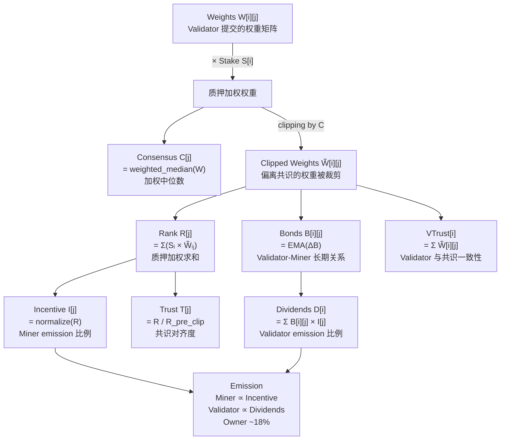

# Bittensor Yuma Consensus 详解

---

## 目录

1. [概述](#1-概述)
2. [算法步骤](#2-算法步骤)
3. [具体计算示例](#3-具体计算示例)
4. [Metagraph 参数速查](#4-metagraph-参数速查)
5. [Subnet 超参数](#5-subnet-超参数)
6. [Taostats 页面说明](#6-taostats-页面说明)

---

## 1. 概述

**核心问题**：多个 Validator 各自评分，如何防止勾结？

Yuma Consensus 的解法：
- 用**质押加权中位数**（而非均值）作为共识基准，少数大户无法单独操纵
- **Clipping**：偏离共识的评分被截断，偷分失效
- **Bond EMA**：Validator 与 Miner 积累长期关系，频繁切换收益少

输入：权重矩阵 W（每个 Validator 对每个 Miner 的评分）
输出：Incentive（Miner emission）、Dividends（Validator emission）

---

## 2. 算法步骤

```
输入：
  W[i][j]  — Validator i 对 Miner j 的评分（已归一化，∑j W[i][j] = 1）
  S[i]     — Validator i 的质押量

Step 1  质押加权
        每个 Validator 的评分权重 ∝ S[i]

Step 2  共识向量（Consensus）
        C[j] = weighted_median({W[i][j]}, weights={S[i]})
        → 使用中位数，抵抗极端评分

Step 3  共识裁剪（Clipping）
        W̃[i][j] = min(W[i][j], C[j])
        → 超出共识的评分被压回，偷高分失效

Step 4  Rank（Miner 排名）
        R[j] = Σᵢ S[i] × W̃[i][j]

Step 5  Incentive（Miner emission 比例）
        I[j] = R[j] / Σₖ R[k]          ← 归一化

Step 6  Trust（共识对齐度）
        T[j] = R[j] / R_pre_clip[j]     ← 越接近 1.0 越诚实

Step 7  Bond（Validator-Miner 长期关系）
        ΔB[i][j] = (S[i] × W̃[i][j]) / R[j]
        B[i][j]  = α × ΔB[i][j] + (1-α) × B_prev[i][j]   (EMA)

Step 8  Dividends（Validator emission 比例）
        D[i] = Σⱼ B[i][j] × I[j]       ← Validator 分享 Miner 的收益
```

### 参数推导关系图



---

## 3. 具体计算示例

### 场景设定

| | V1 | V2 |
|---|---|---|
| **Stake** | 100 TAO | 60 TAO |

| | M0 | M1 | M2 |
|---|---|---|---|
| **V1 权重** | 0.7 | 0.2 | 0.1 |
| **V2 权重** | 0.4 | 0.5 | 0.1 |

> V2 认为 M1 比 V1 评估的更好（0.5 vs 0.2），这个分歧将触发 Clipping。

---

### Step 2：Consensus（加权中位数）

加权中位数：对值升序排列，找到累计权重首次 ≥ 总权重/2 时对应的值。

**M0**：升序排列 [(0.4, V2=60), (0.7, V1=100)]，总权重 160，半数 = 80
| 值 | 累计权重 | 是否过半 |
|----|---------|---------|
| 0.4 | 60 | 60 < 80，继续 |
| 0.7 | 160 | 160 ≥ 80，**停止** |

→ **C[M0] = 0.7**

**M1**：升序排列 [(0.2, V1=100), (0.5, V2=60)]，半数 = 80
| 值 | 累计权重 | 是否过半 |
|----|---------|---------|
| 0.2 | 100 | 100 ≥ 80，**停止** |

→ **C[M1] = 0.2**

**M2**：两者都是 0.1 → **C[M2] = 0.1**

```
C = [0.7, 0.2, 0.1]
```

> **规律**：V1 持有 100/(100+60) = 62.5% 的 stake，超过半数，所以 V1 的评分在任何 Miner 上都等于加权中位数。2 个 Validator 时，**majority stake 方永远决定共识**。

---

### Step 3：Clipping

规则：`W̃[i][j] = min(W[i][j], C[j])`

只截断**高于共识**的评分，低于共识的评分保持不变。

```
W̃[V1] = min([0.7, 0.2, 0.1], C=[0.7, 0.2, 0.1]) = [0.7, 0.2, 0.1]  ← 无变化
W̃[V2] = min([0.4, 0.5, 0.1], C=[0.7, 0.2, 0.1]) = [0.4, 0.2, 0.1]
                                                          ↑
                                               0.5 > C[M1]=0.2，截断
```

| Validator | Miner | 原始值 | C | 操作 | 结果 |
|-----------|-------|--------|---|------|------|
| V2 | M0 | 0.4 | 0.7 | 0.4 **<** 0.7，低于共识，**保留** | 0.4 |
| V2 | M1 | 0.5 | 0.2 | 0.5 **>** 0.2，高于共识，**截断** | 0.2 |

> **设计意图**：Clipping 只惩罚"给分比共识高"（拉抬自己的 Miner）；给分低于共识不受影响。V2 对 M0 给的 0.4 低于共识 0.7，属于保守评分，不被截断。

---

### Step 4-5：Rank & Incentive

| Miner | Rank 计算 | Rank | Incentive |
|-------|-----------|------|-----------|
| M0 | 100×0.7 + 60×0.4 = 70+24 | **94** | 94/142 = **0.662** |
| M1 | 100×0.2 + 60×0.2 = 20+12 | **32** | 32/142 = **0.225** |
| M2 | 100×0.1 + 60×0.1 = 10+6  | **16** | 16/142 = **0.113** |
| 合计 | | 142 | 1.000 |

---

### Step 6：Trust

Pre-clip Rank（用原始权重计算）：
- M0: 100×0.7 + 60×0.4 = 94（同上，V2 未被 clip）
- M1: 100×0.2 + 60×**0.5** = 20+30 = **50**（V2 原始 0.5）
- M2: 16（同上）

```
T[M0] = 94/94  = 1.00   ← 所有人评分一致
T[M1] = 32/50  = 0.64   ← V2 给了偏高分，被 clip
T[M2] = 16/16  = 1.00
```

---

### Step 7：Bond（首个 tempo，无历史，B_prev = 0）

```
ΔB[V1][M0] = (100×0.7)/94 = 0.745    ΔB[V2][M0] = (60×0.4)/94 = 0.255
ΔB[V1][M1] = (100×0.2)/32 = 0.625    ΔB[V2][M1] = (60×0.2)/32 = 0.375
ΔB[V1][M2] = (100×0.1)/16 = 0.625    ΔB[V2][M2] = (60×0.1)/16 = 0.375
```

> Bond 之和 = 1（每列），V1 因质押更高在多数 Miner 上持有更大 bond。

---

### Step 8：Dividends

```
D[V1] = 0.745×0.662 + 0.625×0.225 + 0.625×0.113
      = 0.493 + 0.141 + 0.071 = 0.705

D[V2] = 0.255×0.662 + 0.375×0.225 + 0.375×0.113
      = 0.169 + 0.084 + 0.042 = 0.295
```

---

### Emission 分配（假设该 tempo 子网分得 100 Alpha）

| 接收方 | 比例 | Alpha |
|--------|------|-------|
| M0 | 41% × 0.662 | **27.1** |
| M1 | 41% × 0.225 | **9.2** |
| M2 | 41% × 0.113 | **4.6** |
| V1 | 41% × 0.705 | **28.9** |
| V2 | 41% × 0.295 | **12.1** |
| Owner | 18% | 18.0 |
| **合计** | | **100** |

**结论**：
- V2 给 M1 打的高分 (0.5) 被 clip 到 0.2，实际影响等同于 V1 的评分
- V2 的 Dividends 只有 12.1 Alpha，远少于 V1 的 28.9，**偷分没有收益**
- M1 的 Trust=0.64，反映其评分有争议

---

## 4. Metagraph 参数速查

> 查看：`btcli subnets metagraph --netuid 19` 或 [taostats.io/subnets/19/metagraph](https://taostats.io/subnets/19/metagraph)

| 参数 | 适用角色 | 含义 | 取值 |
|------|---------|------|------|
| **UID** | 所有 | 子网内唯一编号 | 0~255 |
| **Stake** | 所有 | `Alpha_Stake + TAO_Stake × 0.18`，决定共识权重 | ≥ 0 |
| **Rank** | Miner | Clipping 后质押加权评分和 | 0~1 |
| **Incentive** | Miner | 归一化 Rank，决定 emission 比例 | 0~1 |
| **Trust** | Miner | `R / R_pre_clip`，越接近 1 越诚实 | 0~1 |
| **Consensus** | Miner | 加权中位数，作为 clipping 阈值 | 0~1 |
| **Dividends** | Validator | Bond × Incentive 的加权和，Validator 收益来源 | 0~1 |
| **VTrust** | Validator | Clipped 权重总和，衡量与共识的一致性 | 0~1 |
| **Emission** | 所有 | 每 tempo 获得的 Alpha（单位 rao = 10⁻⁹） | ≥ 0 |
| **Axon** | Miner | 服务端点 IP:Port，Validator 直连用 | - |
| **Updated** | 所有 | 上次 set_weights 的区块号 | block |
| **Active** | 所有 | activity_cutoff 窗口内是否活跃 | bool |

**Stake 计算说明：**
```
Stake = Alpha_Stake + TAO_Stake × 0.18
```
- `0.18`（tao_weight）鼓励直接质押到子网获 Alpha，而非只持有 TAO
- Alpha 占权重主导（~82%），TAO 只占 ~18%
- 与 Owner 的 18% take rate 无关，只是数值巧合

---

## 5. Subnet 超参数

> 查看：`btcli subnets hyperparameters --netuid 19`

| 参数 | 含义 | 典型值 |
|------|------|--------|
| **tempo** | emission 结算间隔（blocks） | 360（≈72 min）|
| **max_uids** | 子网最大节点数 | 256 |
| **immunity_period** | 新注册节点免淘汰期（blocks） | 4096（≈13.6 h）|
| **kappa (κ)** | 共识 clipping 百分位（50% = 中位数）| 32767（≈50%）|
| **bonds_moving_avg** | Bond EMA 系数 α | 0.9 |
| **min_allowed_weights** | Validator 最少给几个 Miner 打分 | 8 |
| **activity_cutoff** | 不活跃判定（blocks）| 5000（≈16.7 h）|

---

## 6. Taostats 页面说明

| 标签页 | 内容 | 用途 |
|--------|------|------|
| **Chart** | Alpha 价格、emission 趋势、stake 变化 | 看子网整体健康度 |
| **Metagraph** | 所有节点完整状态（UID、Stake、Incentive 等） | 对照本文参数讲解 |
| **Miner Weights** | Validator 对 Miner 的权重矩阵可视化 | 直观看 Yuma Consensus |
| **Distribution** | Emission 分布、Stake 分布 | 看激励是否集中 |
| **Registration** | 节点注册/退出历史 | 看子网活跃度变化 |
| **Statistics** | 超参数（tempo、max_uids 等）| 查子网配置 |
