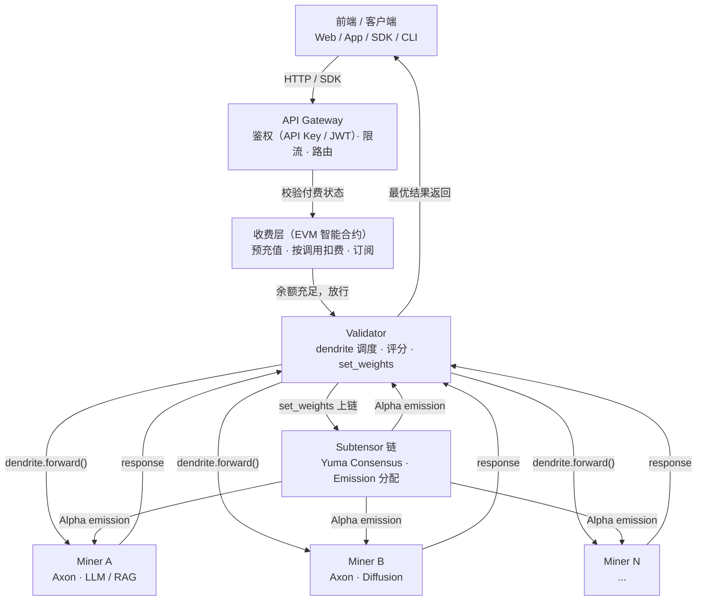
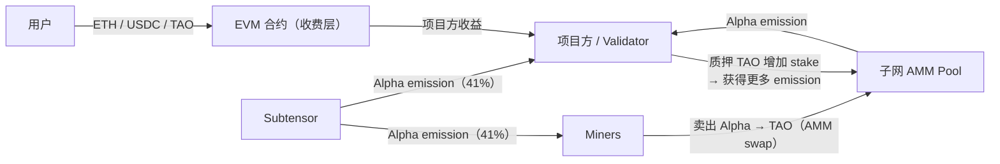
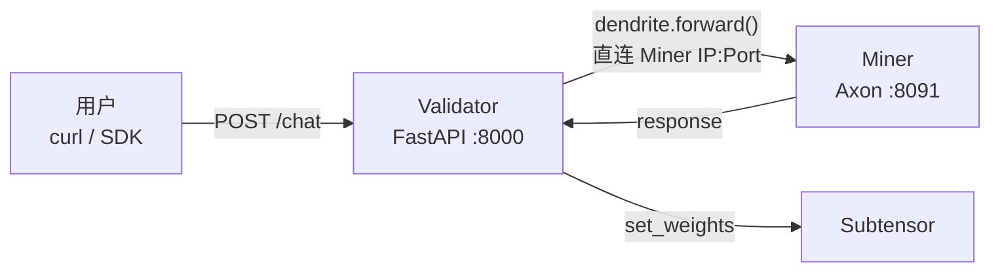

# Bittensor 商业化场景：AI API 产品化

## 一、整体架构

### 调用链



### 资金流



---

## 二、收费模型（三种主流）

| 模式 | 流程 | 特点 |
|------|------|------|
| **预付费 Credits** | 用户充值 → 合约记余额 → 每次调用扣减 | 类似 OpenAI credits，体验好 |
| **按调用付费** | 用户签名 → 合约验证 → 扣费 → 放行 | 精细计费（token / request），适合高价值 API |
| **订阅制** | 持有 NFT / token → API 验证持仓 → 限额调用 | Web3-native，适合 SaaS |

---

## 三、Demo A：直接调用现有子网 API

无需部署任何节点，注册 API Key 后直接调用。

### SN64 Chutes（无服务器 AI 平台）

> 160B+ tokens/day，支持任意模型，OpenAI 兼容

**注册（一次性）：**
```bash
pip install chutes openai
chutes register                              # 用 Bittensor wallet 签名
chutes keys create --name demo-key --admin   # 得到 cpk_xxx
```

**调用：**
```python
from openai import OpenAI

client = OpenAI(
    api_key="cpk_your_key_here",
    base_url="https://llm.chutes.ai/v1",
)

resp = client.chat.completions.create(
    model="deepseek-ai/DeepSeek-V3-0324",
    messages=[{"role": "user", "content": "你好，请用一句话介绍你自己"}],
    max_tokens=128,
)
print(resp.choices[0].message.content)
print(f"model: {resp.model}  tokens: {resp.usage.total_tokens}")
```

对照 [taostats.io/subnets/64/metagraph](https://taostats.io/subnets/64/metagraph) 可查看哪些矿工在处理请求。

---

### SN19 Nineteen（高频推理，低延迟）

> 在 [nineteen.ai/app/api](https://nineteen.ai/app/api) 申请 API Key

```python
from openai import OpenAI

client = OpenAI(
    api_key="your_nineteen_key",
    base_url="https://api.nineteen.ai/v1",
)

resp = client.chat.completions.create(
    model="unsloth/Llama-3.2-3B-Instruct",
    messages=[{"role": "user", "content": "你好，请用一句话介绍你自己"}],
    max_tokens=500,
    temperature=0.5,
)
print(resp.choices[0].message.content)
```

---

### 读取链上 Metagraph（无需 API Key）

```bash
btcli subnet metagraph --netuid 19
btcli subnet metagraph --netuid 64
```

---

## 四、Demo B：自建 Validator 对外提供 API

适合想自己运营子网或做定制调度的场景。



**创建 subnet 并对外提供服务**
```bash
# 查看 stake 
btcli stake list --wallet.name mywallet --subtensor.network test

# 创建 subnet
btcli subnet create --wallet.name mywallet --wallet.hotkey myhotkey --subtensor.network test
# 加入 subnet
btcli subnet register --netuid 461 --wallet.name mywallet --wallet.hotkey myhotkey  --subtensor.network test

# 启动 miner
python miner.py --netuid 461

## 启动 validator
python validator.py --netuid 461

## 访问 validator 
curl -X POST http://localhost:8000/chat -H "Content-Type: application/json" -d '{"prompt": "今天天气如何"}'
```

---

## 五、与传统 Web2 AI 架构对比

| 模块 | Web2（OpenAI） | Bittensor 方案 |
|------|--------------|----------------|
| API | OpenAI API | 自建 API Gateway |
| 模型 | 自有 | 去中心化 Miners |
| 调度 | 内部黑盒 | Validator（可审计） |
| 收费 | Stripe | EVM 合约 |
| 激励 | 公司利润 | Emission + Fee |
| 抗审查 | 无 | 无许可，全球节点 |
