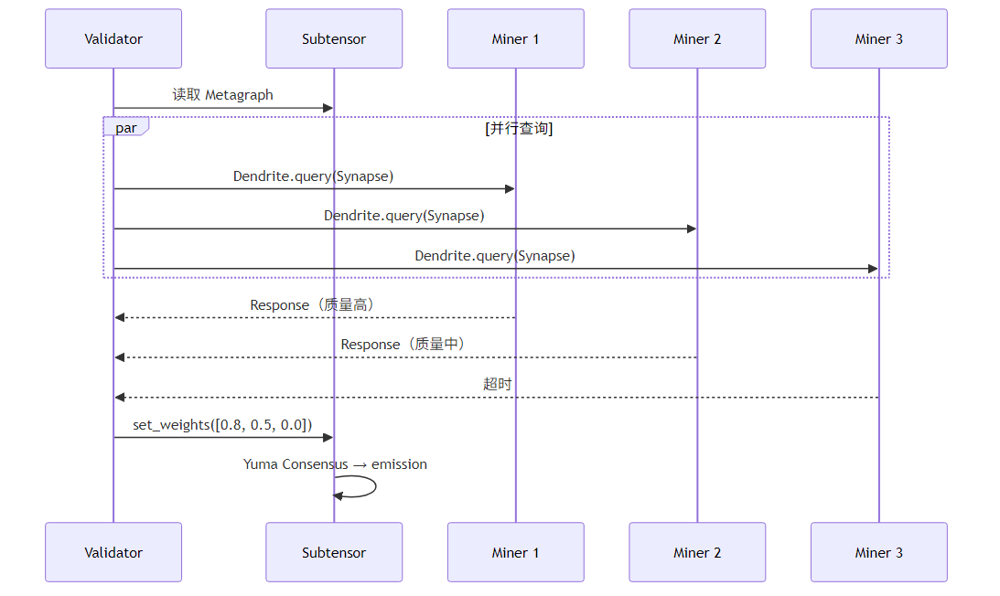
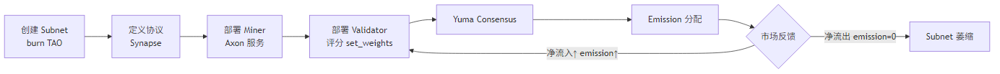

<!-- _class: lead -->

# Bittensor 技术分享

**去中心化 AI 能力市场**

---

## 2026.3.20 — 黄仁勋说了什么？

> "现代版 Folding@home"
> — NVIDIA CEO 黄仁勋，评价 Covenant-72B

- SN3 alpha token 一月内涨 **444%**
- TAO 代币同步翻倍，峰值 **$377**
- Chamath Palihapitiya 向黄仁勋展示：用 70+ 个普通节点训练 72B 大模型

---

## Covenant-72B：史上最大去中心化 LLM 预训练

| 指标 | 数值 |
|------|------|
| 参数量 | **72B** |
| 训练数据 | ~1.1 万亿 token |
| 参与节点 | **70+，无许可** |
| MMLU 得分 | **67.1**（对标 Llama-2-70B）|
| 基础设施 | 普通商用互联网，无数据中心 |

> **这是怎么做到的？Bittensor 如何激励 70 个陌生节点协同训练？**

---

<!-- _class: lead -->

# Part 1 · Bittensor 是什么？

---

## 核心定位

> 比特币激励全球矿工**维护账本**
> Bittensor 激励全球 GPU 节点**竞争产出最优 AI 智能**

- **不是**出租算力（≠ Akash / Render）
- 而是**评估 AI 输出质量**，奖励最优输出的参与者
- 每个子网自定义 AI 任务：推理 / 训练 / embedding / 图像…

---

## 和以太坊的区别

| 维度 | 以太坊 | Bittensor |
|------|--------|-----------|
| 解决的问题 | 去中心化通用计算 | 去中心化 AI 能力市场 |
| 节点工作 | 执行 EVM 字节码 | 运行 AI 模型，竞争最优输出 |
| 共识目标 | 对"状态转移"达成一致 | 对"AI 输出质量"达成一致 |
| 激励对象 | 区块验证者（质押 ETH）| Miner/Validator（质量越高收益越多）|
| 链技术 | EVM / Solidity | Substrate / Rust |

**关键差异：Bittensor 本质是一个链上 AI 质量排名系统**

---

<!-- _class: lead -->

# Part 2 · 网络架构

---

## 三层结构

```
┌──────────────────────────────────────────────────────┐
│              Subtensor（区块链层）                    │
│  Substrate / Rust，出块 ~12s                         │
│  负责：注册、质押、Yuma Consensus、emission 分配      │
├──────────┬──────────┬──────────┬────────────────────┤
│ Subnet19 │ Subnet64 │ Subnet 3 │    Subnet N        │
│ LLM 推理 │ 无服务器  │  分布式   │    127 个子网       │
├──────────┴──────────┴──────────┴────────────────────┤
│    每个子网：Miners（执行）+ Validators（评分）        │
└──────────────────────────────────────────────────────┘
```

---

## 角色与收益

| 角色 | 职责 | Alpha Emission |
|------|------|----------------|
| **Miner** | 运行 AI 任务，通过 Axon 暴露服务 | **41%** |
| **Validator** | 查询 Miner，评分，set_weights | **41%** |
| **Subnet Owner** | 定义任务规则，维护子网 | **18%** |

---

## SDK 命名来源：神经科学隐喻

| 术语 | 对应概念 |
|------|---------|
| **Axon** | Miner 的服务端点（监听端口） |
| **Dendrite** | Validator 的请求客户端 |
| **Synapse** | 请求 / 响应的消息结构体 |
| **Metagraph** | 子网所有节点状态的链上快照 |

---

<!-- _class: lead -->

# Part 3 · 核心流程

---

## Miner-Validator 交互



---

## Emission ① Injection（每 Block ~12s）

```
0.5 TAO 按各子网净流入 EMA 分配 → 三路注入：
  TAO Reserve  += Δτ          增加流动性
  Alpha Reserve += Δτ / p     维持价格不变
  Alpha Outstanding += α       待分配给参与者（上限 1/block）
```

子网 emission 份额 ∝ **净 TAO 流入的 EMA（86.8 天窗口）**
净流入多 → 更多 emission　净流出 → emission 归零

---

## Emission ② Distribution（每 Tempo ~72min）

| 接收方 | 比例 |
|--------|------|
| Subnet Owner | 18% |
| Miners（按 Incentive）| 41% |
| Validators & Stakers（按 Dividends）| 41% |

> Miner/Validator 收到的是 **Alpha Token**，TAO Staker 份额通过 AMM 自动 swap 为 TAO

---

## Subnet 生命周期



---
