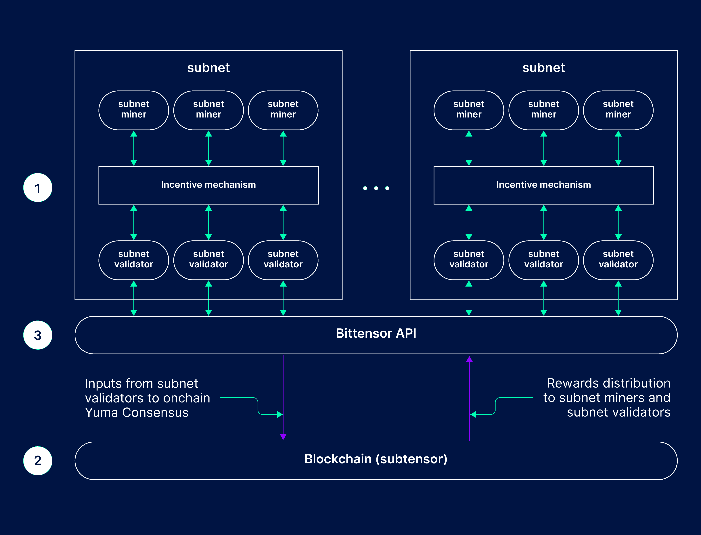
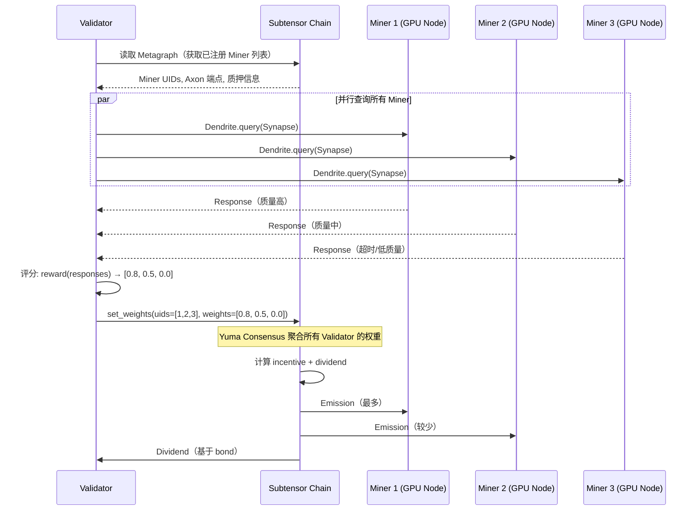
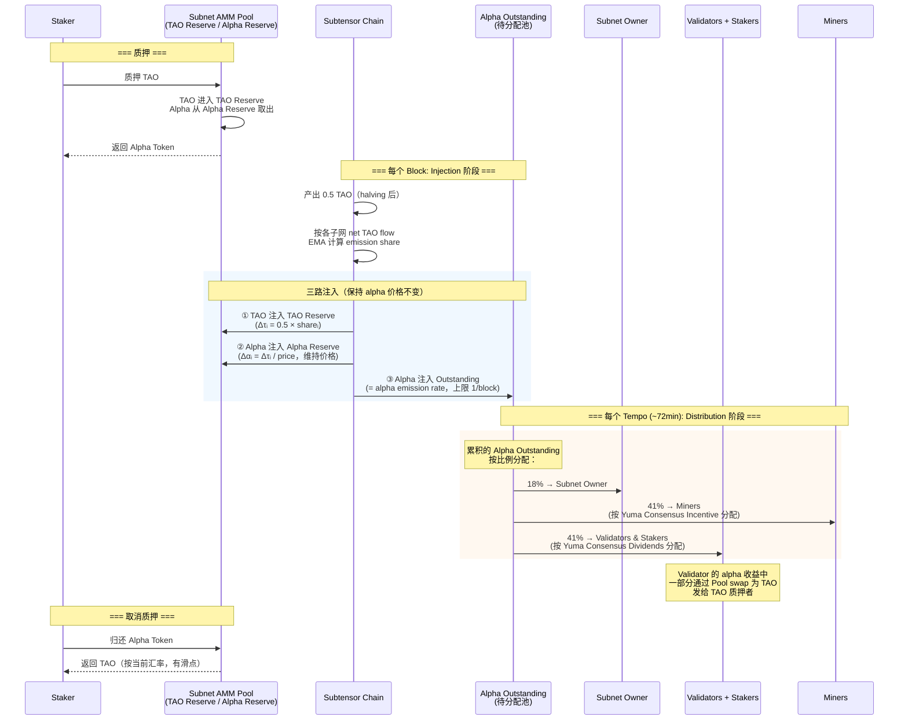
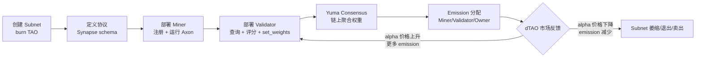

# Bittensor 技术分享

---

## 1. Bittensor 是什么？解决什么问题？

### 核心定位

Bittensor 是一个**去中心化 AI 能力市场**：用经济激励驱动全球节点竞争产出最优 AI 输出，而不是租算力。

> 类比：比特币激励全球矿工维护账本；Bittensor 激励全球 GPU 节点竞争产出最优智能。

### 和以太坊的区别

| 维度 | 以太坊 | Bittensor |
|------|--------|-----------|
| **解决的问题** | 去中心化通用计算（智能合约） | 去中心化 AI 能力市场 |
| **节点工作** | 执行 EVM 字节码，验证交易 | 运行 AI 模型，竞争产出最优输出 |
| **共识目标** | 对"状态转移"达成一致 | 对"AI 输出质量"达成一致 |
| **激励对象** | 区块验证者（质押 ETH） | AI Validator/Miner（质量越高收益越多）|
| **链技术** | EVM / Solidity | Substrate / Rust |
| **可组合性** | 任意合约互调 | 子网独立，各自定义 AI 任务 |

**关键差异**：以太坊验证"计算是否正确执行"，Bittensor 评估"AI 输出质量是否最优"——后者本质是一个**链上 AI 质量排名系统**。

---

## 2. 网络架构

### 三层结构



```
┌─────────────────────────────────────────────────┐
│              Subtensor（区块链层）               │
│   Substrate / Rust，出块 ~12s                   │
│   负责：注册、质押、Yuma Consensus、emission 分配 │
├──────────┬──────────┬──────────┬────────────────┤
│ Subnet 1 │ Subnet 3 │ Subnet 9 │   Subnet N     │
│ LLM 推理 │ 去中心化  │ 模型预训 │   ...          │
│          │   训练   │    练    │                │
├──────────┴──────────┴──────────┴────────────────┤
│  每个子网：Miners（执行）+ Validators（评分）     │
└─────────────────────────────────────────────────┘
```

### 角色

| 角色 | 职责 | 收益 |
|------|------|------|
| **Miner** | 运行 AI 任务（推理/训练），通过 Axon 暴露服务 | 按输出质量获得 Alpha emission（41%）|
| **Validator** | 查询 Miner，评估质量，提交权重上链 | 按 Bond 积累获得 Alpha emission（41%）|
| **Subnet Owner** | 定义任务规则，维护子网 | 固定 18% Alpha emission |

### 神经科学隐喻（SDK 命名来源）

| 术语 | 对应概念 |
|------|---------|
| **Axon** | Miner 的 RPC 服务端点 |
| **Dendrite** | Validator 的请求客户端 |
| **Synapse** | 请求/响应的消息结构体 |
| **Metagraph** | 子网所有节点状态的快照（链上数据） |

---

## 3. 核心流程


### Subnet 内 Miner-Validator 交互流程

> 以 SN3 (Templar) 为例：Miner 提交训练好的模型梯度，Validator 评估训练贡献质量



### dTAO 质押与 Emission 流程

> Emission 是**两阶段**过程：先是每个 block 的 **Injection**（注入流动性到子网池），再是每个 tempo (~360 blocks) 的 **Distribution**（分配给参与者）



### Emission 注入的关键细节

**Q: 每个 block 产出的 0.5 TAO 如何在子网间分配？**

当前使用 **Flow-Based Model**（2025.11 上线，替代了之前的 price-based model）：

```
1. 跟踪每个子网的 net TAO flow：
   net_flow = Σ(TAO staked) - Σ(TAO unstaked)

2. 计算 EMA（86.8 天窗口，30 天半衰期）：
   S_i = (1-α) × S_{i-1} + α × net_flow_i    (α ≈ 0.000003209)

3. 计算动态下界 L（相对基准）：
   L = max(FlowCutoff, min_j( min(S_j, 0) ))
   │   └─ 治理参数，防止 L 过低   └─ 所有子网 EMA 中最负的那个（正值取 0）

4. 裁剪 + 归一化：
   z_i = max(S_i - L, 0)
   share_i = z_i / Σ z_j         （线性分配）

   作用：把最差子网的 z_i 归零，其余子网按相对优势分配 emission

4. 最终注入：
   Δτ_i = 0.5 TAO × share_i
```

→ **净流入多的子网获得更多 emission**；净流出的子网 emission 为零

**Q: 注入到子网池后发生什么？三路注入保持价格不变**

```
子网 i 每个 block 的注入：

① TAO Reserve += Δτ_i         （TAO 储备增加）
② Alpha Reserve += Δτ_i / p_i  （Alpha 储备按价格比例增加，保持价格 p_i 不变）
③ Alpha Outstanding += min(Δτ̄/Σp_j, 1)  （待分配的 Alpha，上限 1/block）
```

- ① 和 ② 增加池的流动性（降低交易滑点），但**不改变 alpha 价格**
- ③ 是真正要分给参与者的 Alpha

**Q: Miner 和 Validator 收到的是 Alpha 还是 TAO？**

```
每个 tempo (~360 blocks) 结算：

Alpha Outstanding 累积量按比例分配：
├── 18% → Subnet Owner（收到 Alpha）
├── 41% → Miners（收到 Alpha，按 Incentive 分配）
└── 41% → Validators & Stakers
    ├── Validator 抽取佣金（Alpha）
    └── 剩余分给 Stakers：
        ├── Alpha Stakers → 收到 Alpha
        └── TAO Stakers → Alpha 通过池 swap 为 TAO 后发放
```

**核心回答：Miner 和 Validator 直接收到的是子网的 Alpha Token，不是 TAO。** TAO Staker 的收益会通过 AMM 池自动 swap 为 TAO。

### Subnet 生命周期



---

## 4. Yuma Consensus

**核心问题**：Validator 互相勾结给自己 Miner 打高分怎么办？

### 算法

```
输入：权重矩阵 W[i][j]（Validator i 对 Miner j 的评分）

1. 质押加权
   每个 Validator 的权重按其质押量 S[i] 缩放

2. 共识向量（加权中位数，非均值）
   C[j] = weighted_median({ W[i][j] }, weights={ S[i] })

3. 共识裁剪（Clipping）
   W̃[i][j] = min(W[i][j], C[j])
   偏离共识的权重被压低，偷分失效

4. Rank & Incentive（决定 Miner emission）
   R[j] = Σᵢ S[i] × W̃[i][j]
   I[j] = R[j] / Σₖ R[k]   ← 归一化

5. Bond & Dividends（决定 Validator emission）
   B[i][j] = EMA(ΔB[i][j])     ← 长期关系积累
   D[i]    = Σⱼ B[i][j] × I[j] ← 分享 Miner 的收益

6. Trust（衡量评分诚实度）
   T[j] = R[j] / R_pre_clip[j]  ← 接近 1.0 = 与共识一致
```

**防勾结机制**：
- 中位数而非均值 → 少数大户操纵无效
- Bond EMA → 激励 Validator 长期稳定评分，频繁切换者收益少
- Clipping → 偏离共识者影响力被截断

---

## 5. 经济学（dTAO）

### TAO 基本参数

| 参数 | 值 |
|------|-----|
| 总量上限 | 21,000,000（同 BTC）|
| 出块时间 | ~12 秒 |
| 当前区块奖励 | 0.5 TAO（2025.12 减半后）|
| 每日产出 | ~3,600 TAO |

### 每个子网的 AMM 池

```
质押 TAO：TAO → 进 TAO Pool，Alpha 从 Alpha Pool 取出 → 用户得 Alpha
解除质押：Alpha → 进 Alpha Pool，TAO 从 TAO Pool 取出 → 用户得 TAO

Alpha 价格 = TAO Pool / Alpha Pool（恒定乘积 AMM，无手续费）
```

### 子网 emission 份额如何决定

```
每个子网的份额 ∝ 净 TAO 流入的 EMA（86.8 天窗口）

净流入多 → 获得更多 emission
净流出   → emission 归零

=> 质押 TAO 进子网 = 为该子网"投票"
```

### Alpha 价格为什么普遍很低？

Miner/Validator 收到 Alpha 后持续通过 AMM 卖回 TAO（换成稳定收益）→ 形成持续卖压。Alpha 价格反映的是「市场对该子网未来净流入的预期」，而非当前质押量。

### 典型数据（Subnet 1）

```
TAO Pool:   657 τ
Alpha Pool: 161k α
价格:       0.0004 τ/α（即 1 TAO ≈ 2500 Alpha）
EMA 净流入: -0.0338（净流出，emission 为零）
```

---

## 6. SDK 接口

> 模板仓库：[github.com/latent-to/bittensor-subnet-template](https://github.com/latent-to/bittensor-subnet-template)

### 安装

```bash
pip install bittensor bittensor-cli
```

### 三个核心文件

```
bittensor-subnet-template/
├── neurons/
│   ├── miner.py       ← 实现 forward()，处理 Validator 的请求
│   └── validator.py   ← 查询 Miner，打分，set_weights()
└── template/
    └── protocol.py    ← 定义 Synapse（请求/响应结构）
```

### Step 1：定义协议（Synapse）

```python
import bittensor as bt

class MyProtocol(bt.Synapse):
    query: str            # Validator 发送的输入
    response: str = ""    # Miner 填充后返回
```

### Step 2：Miner 实现

```python
# miner.py
def forward(synapse: MyProtocol) -> MyProtocol:
    synapse.response = my_model.generate(synapse.query)
    return synapse

wallet    = bt.Wallet(name="miner", hotkey="h1")
subtensor = bt.Subtensor(network="finney")
axon      = bt.axon(wallet=wallet, port=8091)
axon.attach(forward_fn=forward)
axon.serve(netuid=NETUID, subtensor=subtensor)
axon.start()
```

### Step 3：Validator 实现

```python
# validator.py
import torch

wallet    = bt.Wallet(name="validator", hotkey="h1")
subtensor = bt.Subtensor(network="finney")
dendrite  = bt.dendrite(wallet=wallet)
metagraph = subtensor.metagraph(netuid=NETUID)

# 查询所有 Miner
responses = dendrite.query(
    axons=metagraph.axons,
    synapse=MyProtocol(query="Hello"),
    timeout=12.0
)

# 打分（自定义逻辑）
scores = torch.tensor([1.0 if r.response else 0.0 for r in responses])
weights = scores / scores.sum()

# 写入链上
subtensor.set_weights(
    netuid=NETUID,
    uids=metagraph.uids,
    weights=weights,
    wallet=wallet
)
```

### Step 4：注册并运行

```bash
btcli subnet register --netuid <NETUID> --wallet.name miner --wallet.hotkey h1
python neurons/miner.py     --netuid <NETUID> --wallet.name miner
python neurons/validator.py --netuid <NETUID> --wallet.name validator
```

### 常用 btcli 命令

```bash
btcli subnet list                        # 查看所有子网
btcli subnets metagraph --netuid 3       # 查看 SN3 节点状态
btcli wallet overview                    # 查看余额/质押
btcli stake add --netuid 3 --amount 10   # 质押 TAO 到 SN3
```

---

## 7. Demo：读取 SN3 实时数据

```python
import bittensor as bt
import torch

sub  = bt.Subtensor(network="finney")
meta = sub.metagraph(netuid=3)   # SN3 Templar（Covenant-72B 所在子网）

print(f"节点总数: {meta.n}")
print(f"总质押:   {meta.S.sum():.0f} TAO")

top5 = torch.argsort(meta.I, descending=True)[:5]
print("\nTop 5 Miners（贡献了最多训练梯度）:")
print(f"{'UID':>5} {'Incentive':>10} {'Trust':>8} {'Emission':>12}")
print("-" * 42)
for uid in top5:
    print(f"{uid:>5} {meta.I[uid]:>10.4f} {meta.T[uid]:>8.4f} {meta.E[uid]:>12.4f}")
```

**可以对照**：[taostats.io/subnets/3/metagraph](https://taostats.io/subnets/3/metagraph) 验证输出数据

---

## 8. 真实案例：Covenant-72B

SN3 (Templar) 于 2026 年 3 月完成史上最大去中心化 LLM 预训练：

| 指标 | 数值 |
|------|------|
| 参数量 | **72B** |
| 训练数据 | ~1.1 万亿 token |
| 参与节点 | **70+，无许可** |
| MMLU 得分 | **67.1**（对标 Llama-2-70B）|
| 基础设施 | 普通商用互联网，无数据中心 |

**技术关键 —— SparseLoCo**：本地迭代 15–250 步后，只同步 1–3% 核心梯度（量化为 2-bit，压缩率 97%），通过 S3/R2 对象存储异步交换。解决了去中心化训练的带宽瓶颈。

**市场反应**：SN3 alpha token 一月内涨 444%，黄仁勋称其为"现代版 Folding@home"。

---

## 参考链接

| 资源 | 地址 |
|------|------|
| 官方文档 | [docs.bittensor.com](https://docs.bittensor.com) |
| Subnet 模板 | [github.com/latent-to/bittensor-subnet-template](https://github.com/latent-to/bittensor-subnet-template) |
| SN3 源码 | [github.com/tplr-ai/templar](https://github.com/tplr-ai/templar) |
| 网络浏览器 | [taostats.io](https://taostats.io) |
| SN3 Metagraph | [taostats.io/subnets/3/metagraph](https://taostats.io/subnets/3/metagraph) |
| Covenant-72B 报告 | [templarresearch.substack.com](https://templarresearch.substack.com/p/checkpoint-one) |
