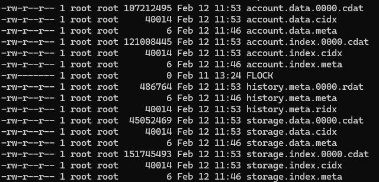

# Geth Code Storage

## Ethereum Node Storage Reality Problem

### The Storage Explosion

Ethereum is an append-only system:

- Blocks continuously accumulate
- State grows monotonically
- Archive nodes reach multi-terabyte scale
- Pebble suffer from:
  - Write amplification
  - Compaction overhead
  - Random IO (especially hash-based trie)

### Key Insight

> Most historical data is immutable and rarely accessed.

Treating hot state and immutable history the same way causes unnecessary IO pressure and compaction cost.

## 2. Hot vs Cold Data

### 🔥 Hot Data

default at [schema.go](https://github.com/ethereum/go-ethereum/tree/master/core/rawdb/schema.go)
- Latest blocks
- Current state trie
- DiffLayer (in-memory mutations)
- Dirty trie node buffer
- Recent Pebble entries

Characteristics:
- Frequently updated
- Low-latency requirement
- Random read/write


---

### ❄️ Cold Data (Freezer)

Freezer (Ancient Store) is Geth’s cold storage engine.
[ancient_scheme.go](https://github.com/ethereum/go-ethereum/tree/master/core/rawdb/ancient_scheme.go)
- Finalized blocks (headers / bodies / receipts / hashs)
- Historical state
- Historical trie nodes
- Immutable index data

Characteristics:
- Append-only
- File-based
- No modified
- Suitable for sequential IO
- Optimized for archive queries
- Block-number indexed

---

### State Layers: DiffLayer & DiskLayer

```go
type layerTree struct {
	base   *diskLayer   // bottom() *diskLayer
	layers map[common.Hash]layer
	// descendants is a two-dimensional map where the keys represent
	// an ancestor state root, and the values are the state roots of
	// all its descendants.
	//
	// For example: r -> [c1, c2, ..., cn], where c1 through cn are
	// the descendants of state r.
    descendants map[common.Hash]map[common.Hash]struct{}
}
```
#### Layered Architecture
```
 DiffLayer@block N+2 (memory)
        ↓
 DiffLayer@block N+1 (memory)
        ↓
 DiffLayer@block N (memory)
        ↓
 DiskLayer (oldest， Pebble)
        ↓
    History Index
        ↓
     Freezer
```
#### DiffLayer
- In-memory state changes
- Dirty trie nodes
- Supports rollback
- Versioned per block

#### DiskLayer
- Persisted trie nodes
- Clean cache
- Backed by Pebble
- Parent of DiffLayer

```
                 ┌──────────────┐
                 │   RPC Layer  │
                 └──────────────┘
                         ↓
         ┌─────────────────────────────┐
         │        State Layer          │
         │  (path-based trie + history)│
         └─────────────────────────────┘
               ↓             ↓
       Pebble (hot)      Freezer (cold)
       ├── trie node      ├── block data
       ├── history index  ├── trie history
       └── state          └── receipts
```


# Freezer

## Freezer File Types

Each freezer table uses:

- `*.cdat`   → data file (compressed data)
- `*.rdat`   → data file (no compressed data)
- `*.cidx`   → index file (compressed data)
- `*.ridx`   → index file (no compressed data)
- `*.meta`   → metadata (table boundary, version, offsets)


Note: 
- compressed means compress before write to *.cdat file or decompress after read from *.cdat.


## Cold Storage Categories
Cold Storage support 3 Categories: 
- Chain: `blockNumber <= head - ancientLimit` and `ancientLimit = 90000 blocks`
- State: write when block commit
- Trienode: write when block commit

note: commit happen when difflayer -> disklayer
```
Block execution
   ↓
Generate diff
   ↓
Add diffLayer
   ↓
Exceeding 128
   ↓
Flush oldest diffLayer to diskLayer (commit)
```

```go
// https://github.com/ethereum/go-ethereum/tree/master/core/rawdb/ancient_scheme.go
const (
	// stateHistoryTableSize defines the maximum size of freezer data files.
	stateHistoryTableSize = 2 * 1000 * 1000 * 1000

    // Chain Data
	ChainFreezerHeaderTable  = "headers"
	ChainFreezerHashTable    = "hashes"
	ChainFreezerBodiesTable  = "bodies"
	ChainFreezerReceiptTable = "receipts"

    //State History
	stateHistoryMeta         = "history.meta"
	stateHistoryAccountIndex = "account.index"
	stateHistoryStorageIndex = "storage.index"
	stateHistoryAccountData  = "account.data"
	stateHistoryStorageData  = "storage.data"

    //Trienode History
	trienodeHistoryHeaderTable       = "trienode.header"
	trienodeHistoryKeySectionTable   = "trienode.key"
	trienodeHistoryValueSectionTable = "trienode.value"
)

// triedb/pathdb/history_state.go
type meta struct {
	version uint8       // version tag of history object
	parent  common.Hash // prev-state root before the state transition
	root    common.Hash // post-state root after the state transition
	block   uint64      // associated block number
}
type SlimAccount struct {
	Nonce    uint64
	Balance  *uint256.Int
	Root     []byte // Nil if root equals to types.EmptyRootHash
	CodeHash []byte // Nil if hash equals to types.EmptyCodeHash
}
type accountIndex struct {
	address       common.Address // The address of account
	length        uint8          // The length of account data, size limited by 255
	offset        uint32         // The offset of item in account data table
	storageOffset uint32         // The offset of storage index in storage index table
	storageSlots  uint32         // The number of mutated storage slots belonging to the account
}
type stateHistory struct {
	meta        *meta                                     // Meta data of history
	accounts    map[common.Address][]byte                 // Account data keyed by its address hash
	accountList []common.Address                          // Sorted account hash list
	storages    map[common.Address]map[common.Hash][]byte // Storage data keyed by its address hash and slot hash
	storageList map[common.Address][]common.Hash          // Sorted slot hash list
}
func (h *stateHistory) encode() ([]byte, []byte, []byte, []byte) { ... ... } 


// triedb/pathdb/history_trienode.go
type trienodeHistory struct {
	meta     *meta                             // Metadata of the history
	owners   []common.Hash                     // List of trie identifier sorted lexicographically
	nodeList map[common.Hash][]string          // Set of node paths sorted lexicographically
	nodes    map[common.Hash]map[string][]byte // Set of original value of trie nodes before state transition
}

// triedb/pathdb/history.go
const (
	typeAccount  elementType = 0 // represents the account data
	typeStorage  elementType = 1 // represents the storage slot data
	typeTrienode elementType = 2 // represents the trie node data
)
type stateIdent struct {
	typ elementType
	addressHash common.Hash // The hash of the account address.
	storageHash common.Hash // The hash of the storage slot key.	
	path        string      // The trie node path within the trie.
}
func (ident stateIdent) String() string {
	if ident.typ == typeAccount {return ident.addressHash.Hex()}
	if ident.typ == typeStorage {return ident.addressHash.Hex() + ident.storageHash.Hex()}
	return ident.addressHash.Hex() + ident.path
}

// core/rawdb/database.go
func Open(db ethdb.KeyValueStore, opts OpenOptions) (ethdb.Database, error) {
    frdb, err := newChainFreezer(chainFreezerDir, opts.Era, opts.MetricsNamespace, opts.ReadOnly)
    if !opts.ReadOnly {
		go func() {
			frdb.freeze(db)
		}()
	}
}
// triedb/database.go
type Database struct {
    diskdb          ethdb.Database               // Persistent storage for matured trie nodes
	tree            *layerTree                   // The group for all known layers    
	stateFreezer    ethdb.ResettableAncientStore // Freezer for storing state histories, nil possible in tests
	stateIndexer    *historyIndexer              // History indexer historical state data, nil possible
	trienodeFreezer ethdb.ResettableAncientStore // Freezer for storing trienode histories, nil possible in tests
	trienodeIndexer *historyIndexer              // History indexer for historical trienode data
}    
func NewDatabase(diskdb ethdb.Database, config *Config) *Database {
    if config.PathDB != nil { db.backend = pathdb.New(diskdb, config.PathDB, config.IsVerkle)
	} else { }
}

// triedb/pathdb/database.go
func New(diskdb ethdb.Database, config *Config, isVerkle bool) *Database {
    db := &Database{ ... }
    db.tree = newLayerTree(db.loadLayers())
    db.setHistoryIndexer()
}
```

## How Freezer Works


### **Demo Code**
```go
// core/rawdb/freezer_table.go
type freezerTableMeta struct {
	file        *os.File // file handler of metadata
	version     uint16   // version descriptor of the freezer table
    virtualTail uint64
}
type freezerTable struct {
	... ...
	head   *os.File            // File descriptor for the data head of the table
	index  *os.File            // File descriptor for the indexEntry file of the table
	files  map[uint32]*os.File // open files, read only except head
	headId uint32              // number of the currently active head file
	tailId uint32              // number of the earliest file

	metadata *freezerTableMeta // metadata of the table
    ... ... 
}
type indexEntry struct {
	filenum uint32 // stored as uint16 ( 2 bytes )
	offset  uint32 // stored as uint32 ( 4 bytes )
}
func (t *freezerTable) retrieveItems(start, count, maxBytes uint64) ([]byte, []int, error) {
    // get count of entry from start from *.ridx file
    indices, err := t.getIndices(start, count)
    // read range data from *.cdat or *.rdat files (from filenum + offset for start to filenum + offset for start + count)
}

// core/rawdb/freezer_batch.go
func (batch *freezerTableBatch) appendItem(data []byte) error {
    if itemOffset+itemSize > int64(batch.t.maxFileSize) {
        batch.commit()
        batch.t.advanceHead()
		itemOffset = 0
	}
    // write data to head file
 	batch.dataBuffer = append(batch.dataBuffer, data...)
	batch.totalBytes += itemSize   
    // write entry := indexEntry{filenum: batch.t.headId, offset: uint32(itemOffset + itemSize)} to index file
    entry := indexEntry{filenum: batch.t.headId, offset: uint32(itemOffset + itemSize)}
	batch.indexBuffer = entry.append(batch.indexBuffer)
    return batch.maybeCommit()
}

```

### **Example**
Each freezer table consists of:

- Data files:  
  `0000.cdat`, `0001.cdat`, ...
- Index file:  
  `table.ridx`
- Metadata file

Each appended item produces:
```go
type indexEntry struct {
	filenum uint32 // stored as uint16 ( 2 bytes )
	offset  uint32 // stored as uint32 ( 4 bytes )
}
```
The offset is cumulative within a data file.

#### Example Scenario: Write Data
- Assume:
```
    maxFileSize = 100 bytes
    headId = 0

We append three items:
    Item 0 → 30 bytes
    Item 1 → 40 bytes
    Item 2 → 50 bytes
```
- Append Item 0 (30 bytes) and Append Item 1 (40 bytes)
0000.cdat file content
```
| item 0 data | item 1 data |
              ↑             ↑
              30            70
```
idx file content
```
|0, 30|0, 70|
      ↑     ↑
      6     12   
```
- Append Item 2 (50 bytes)
  `70 + 50 = 120 > maxFileSize (100)`
    1. Commit current head file (0000.cdat)
    2. Advance head
    3. headId = 1
    4. itemOffset = 0
    5. write item 2 into new file
  0001.cdat file content
```
| item 2 data |
              ↑
              50
```
idx file content
```
|0, 30|0, 70|1, 50|
      ↑     ↑     ↑
      6     12    18   
```


#### Example Scenario: Read Data
- Assume: read `item 1` and `item 2` data writen above
- Read index entries from `.ridx`, can be loaded by size (6) * from and count. We also need previous offset to compute sizes. 
```
Item 1 → (filenum=0, offset=70), size = 70 - 30 = 40 bytes
Item 2 → (filenum=1, offset=50), size = 50 - 0 = 50 bytes
```
- Read data from `30 ~ 70` in `0000.cdat` and `0 ~ 50` in `0001.cdat`
```
0000.cdat
|----30----|----40----|
0001.cdat
|----50----|
```


## How Freezer Builds indexes

### **Demo Code**
```go
// triedb/pathdb/database.go
func (db *Database) setHistoryIndexer() {
	db.stateIndexer = newHistoryIndexer(db.diskdb, db.stateFreezer, db.tree.bottom().stateID(), typeStateHistory)
	db.trienodeIndexer = newHistoryIndexer(db.diskdb, db.trienodeFreezer, db.tree.bottom().stateID(), typeTrienodeHistory)
}
// triedb/pathdb/history_index.go && triedb/pathdb/history_indexer.go
const (
    indexBlockMaxSize = 4096            // The maximum size of a single index block
    historyReadBatch  = 1000            // batch blocks
    historyIndexBatch = 8 * 1024 * 1024 // The number of state history indexes for constructing or deleting as batch
)
type indexMetadata struct {
	Version uint8
	Last    uint64
}
func newHistoryIndexer(disk ethdb.KeyValueStore, freezer ethdb.AncientStore, lastHistoryID uint64, typ historyType) *historyIndexer {
	return &historyIndexer{initer:  newIndexIniter(disk, freezer, typ, lastHistoryID),	typ: typ, disk:  disk, freezer: freezer}
}
func newIndexIniter(disk ethdb.KeyValueStore, freezer ethdb.AncientStore, typ historyType, lastID uint64) *indexIniter {
    initer := &indexIniter{ ... ... }
    go initer.run(lastID)
    return initer
}
func (i *indexIniter) run(lastID uint64) {
    current, err := i.next() // init is i.freezer.Tail() // Number of the first stored item in the freezer
    batch   = newBatchIndexer(i.disk, false, i.typ)
    for current <= lastID {
        count := lastID - current + 1
		if count > historyReadBatch {   
			count = historyReadBatch  
		}
        var histories []history
		if i.typ == typeStateHistory {
			histories, err = readStateHistories(i.freezer, current, count)
		} else {
			histories, err = readTrienodeHistories(i.freezer, current, count)
		}
        for _, h := range histories {
			if err := batch.process(h, current); err != nil {
				i.log.Error("Failed to index history", "err", err)
				return
			}
			current += 1
		}
        batch.finish(true)
    }
    batch.finish(true)
}
func readStateHistories(freezer ethdb.AncientReader, start uint64, count uint64) ([]history, error) {
	var histories []history
	metaList, aIndexList, sIndexList, aDataList, sDataList, err := rawdb.ReadStateHistoryList(freezer, start, count)
	for i := 0; i < len(metaList); i++ {
		var m meta
		m.decode(metaList[i])
		h := stateHistory{meta: &m}
		h.decode(aDataList[i], sDataList[i], aIndexList[i], sIndexList[i])
		histories = append(histories, &h)
	}
	return histories, nil
}

type batchIndexer struct {
	index   map[stateIdent][]uint64   // List of history IDs for tracked state entry
	pending int                       // Number of entries processed in the current batch.
	lastID  uint64                    // ID of the most recently processed history.
	typ     historyType               // Type of history being processed (e.g., state or trienode).
	db      ethdb.KeyValueStore       // Key-value database used to store or delete index data.
}
func (b *batchIndexer) process(h history, id uint64) error {
	for _, key := range h.accountList {
		b.index[key] = append(b.index[key], id)
		b.pending++
	}
	b.lastID = id
	return b.finish(false)
}
func (b *batchIndexer) finish(force bool) error {
    if !force && b.pending < historyIndexBatch {return nil}
    batch := b.db.NewBatchWithSize(ethdb.IdealBatchSize)
    for ident, list := range b.index {
		eg.Go(func() error {
            iw, err := newIndexWriter(b.db, ident, indexed, ident.bloomSize())
			for i, n := range list {
				iw.append(n)     // Index Compression
			}
            iw.finish(batch)
            if batch.ValueSize() >= ethdb.IdealBatchSize {
				if err := batch.Write(); err != nil {return err	}
				batch.Reset()
			}
		})
	}
    if err := eg.Wait(); err != nil {return err}
    storeIndexMetadata(batch, b.typ, b.lastID)
    batch.Write()
    b.pending = 0
	clear(b.index)
}
type indexBlockDesc struct {
	id        uint32 // The id of the index block
	max       uint64 // The maximum state ID retained within the block
	entries   uint16 // The number of state mutation records retained within the block
}
var (
    StateHistoryAccountMetadataPrefix = []byte("ma")  // StateHistoryAccountMetadataPrefix + account address hash => account metadata
    StateHistoryAccountBlockPrefix    = []byte("mba") // StateHistoryAccountBlockPrefix + account address hash + blockID => account block
)
type indexWriter struct {
	descList   []*indexBlockDesc // The list of index block descriptions
	bw         *blockWriter      // The live index block writer
	lastID     uint64            // The ID of the latest tracked history
	state      stateIdent        // The identifier of the state being indexed
	db         ethdb.KeyValueReader
}
func newIndexWriter(db ethdb.KeyValueReader, state stateIdent, limit uint64, bitmapSize int) (*indexWriter, error) {
	blob := rawdb.ReadAccountHistoryIndex(db, state.addressHash)
	descList, err := parseIndex(blob, bitmapSize)
	lastDesc := descList[len(descList)-1]
	indexBlock := readStateIndexBlock(state, db, lastDesc.id)
	bw, err := newBlockWriter(indexBlock, lastDesc, limit, bitmapSize != 0)
	if err != nil {
		return nil, err
	}
	return &indexWriter{
		descList:   descList,
		lastID:     bw.last(),
		bw:         bw,
		state:      state,
		db:         db,
	}, nil
}
func (w *indexWriter) finish(batch ethdb.Batch) {
    rawdb.WriteAccountHistoryIndexBlock(atch, w.state.addressHash, w.bw.desc.id, bw.finish())
	buf := make([]byte, 0, indexBlockDescSize*len(w.descList))
	for _, desc := range w.descList {
		buf = append(buf, desc.encode()...)
	}
    rawdb.WriteAccountHistoryIndex(batch, w.state.addressHash, buf)
}
```

### **Example**
Assume we have an account:
```
address = 0xAAAA...
addressHash = keccak(address) = 0xabc123...
```
This account is modified at the following `stateID`s (or `BlockID`s): `100`, `105`, `106`, `200`, `205`.
- 1. History Stored in Freezer
- 2. Aggregation in batchIndexer: `batchIndexer.process()` builds the following structure. After reaching the batching threshold, `finish()` is executed.
    ```go
        index = {
            stateIdent(0xabc123...) : [100, 105, 106, 200, 205]
        }
    ```
- 3. `indexWriter` Builds Index Blocks
  - Load Existing Metadata
    Assume this is the first write: `descList = []` and A new index block is created: `blockID = 0`
  - Compress stateID List
    Original list: `[100, 105, 106, 200, 205]`. Compression example (delta + varint style):
    ```
        100
        +5
        +1
        +94
        +5
    ```
    Compressed byte stream: `[100][5][1][94][5]`
  - Generate indexBlockDesc
    ```go
    indexBlockDesc{
        id      = 0     // index block ID
        max     = 205   // maximum stateID stored in this block
        entries = 5     // number of mutation records
    }
    ```
- 4. Written to pebble
    Two types of keys are written.
    ```    
        ma + 0xabc123...  => [ {id:0, max:205, entries:5} ]
        mba + 0xabc123... + 0 => compressed([100,105,106,200,205])
    ```

---

## How Freezer is Used


### Sample 1: eth_GetBalance

This document walks through a concrete example of how `eth_getBalance(address, blockNumber)` works in PathDB mode
when querying historical state.
- States at the current disk layer or above are directly accessible via `db.StateReader`.
- States older than the current disk layer (including the disk layer itself) are available via `db.HistoricReader`.

We follow the call chain:
GetBalance
→ StateAndHeaderByNumberOrHash(...) 
→ StateAt(root) 
→ HistoricState(root)
→ stateHistoryReader.read(...)
→ indexReader.readGreaterThan(...)

#### **Demo Code** 
```go
func (api *BlockChainAPI) GetBalance(ctx context.Context, address common.Address, blockNrOrHash rpc.BlockNumberOrHash) (*hexutil.Big, error) {
	state, _, err := api.b.StateAndHeaderByNumberOrHash(ctx, blockNrOrHash)
	return (*hexutil.Big)(state.GetBalance(address).ToBig()), state.Error()
}
func (b *EthAPIBackend) StateAndHeaderByNumberOrHash(ctx context.Context, blockNrOrHash rpc.BlockNumberOrHash) (*state.StateDB, *types.Header, error) {
	header, err := b.HeaderByHash(ctx, hash)
	stateDb, err := b.eth.BlockChain().StateAt(header.Root)
	if err != nil {
		stateDb, err = b.eth.BlockChain().HistoricState(header.Root)
	}
	return stateDb, header, nil
}
func (r *stateHistoryReader) read(state stateIdentQuery, stateID uint64, lastID uint64, latestValue []byte) ([]byte, error) {
	lastIndexed, err := checkStateAvail(state.stateIdent, typeStateHistory, r.freezer, stateID, lastID, r.disk)
	ir, err = newIndexReaderWithLimitTag(r.disk, state.stateIdent, lastIndexed, 0)
	historyID, err := ir.readGreaterThan(stateID, lastID)
	// The state was not found in the state histories, as it has not been modified
	// since stateID. Use the data from the associated disk layer instead.
	if historyID == math.MaxUint64 {
		return latestValue, nil
	}
	if state.typ == typeAccount {
		return r.readAccount(state.address, historyID)
	}
	return r.readStorage(state.address, state.storageKey, state.storageHash, historyID)
}
// readGreaterThan locates the first element that is greater than the specified
// id. If no such element is found, MaxUint64 is returned.
func (r *indexReader) readGreaterThan(id uint64) (uint64, error) {
	it := r.newIterator(nil)
	found := it.SeekGT(id)
	if !found {
		return math.MaxUint64, nil
	}
	return it.ID(), nil
}
func (it *indexIterator) SeekGT(id uint64) bool {
	index := sort.Search(len(it.descList), func(i int) bool {
		return id < it.descList[i].max
	})
    blockIt, err := it.reader.newBlockIter(it.descList[index].id, it.filter)
	// Terminate if the element which is greater than the id can be found in the
	// last block; otherwise move to the next block. It may happen that all the
	// target elements in this block are all less than id.
	if blockIt.SeekGT(id) {
		return true
	}
	return it.Next()
}

```

```go
// GetBalance fack code
func (api *BlockChainAPI) GetBalance(ctx context.Context, address common.Address, blockNrOrHash rpc.BlockNumberOrHash) (*hexutil.Big, error) {
    state, _, err := api.b.StateAndHeaderByNumberOrHash(ctx, blockNrOrHash)
        header, err := b.HeaderByHash(ctx, hash)
        stateDb, err := b.eth.BlockChain().StateAt(header.Root) 
            state.New(root, bc.statedb)
        if err != nil { stateDb, err = b.eth.BlockChain().HistoricState(header.Root) }
            sr, err := db.triedb.HistoricStateReader(stateRoot) // -> pdb.HistoricReader(root) // triedb\database.go
                id := rawdb.ReadStateID(db.diskdb, root)  // diskdb ethdb.Database // Persistent storage for matured trie nodes
                meta, err := readStateHistoryMeta(db.stateFreezer, *id+1)
                    db.Ancient(stateHistoryMeta, id-1)
                return &HistoricalStateReader{id:*id,	db:db,	reader: newStateHistoryReader(db.diskdb, db.stateFreezer)}
        return stateDb, header
    b := state.GetBalance(address).ToBig()
        stateObject := s.getStateObject(addr)
            acct, err := s.reader.Account(addr) 
                blob, err := r.AccountRLP(address)
                    dl := r.db.tree.bottom() // Disklayer
                    hash := crypto.Keccak256Hash(address.Bytes())
	                latest, err := dl.account(hash, 0) 
                    return r.reader.read(newAccountIdentQuery(address, hash), r.id, dl.stateID(), latest) 
                        lastIndexed, err := checkStateAvail(state.stateIdent, typeStateHistory, r.freezer, stateID, lastID, r.disk)
                        ir, err = newIndexReaderWithLimitTag(r.disk, state.stateIdent, lastIndexed, 0)
                        historyID, err := ir.readGreaterThan(stateID, lastID) // readGreaterThan locates the first element that is greater than the specified
                        	it := r.newIterator(nil)
	                        found := it.SeekGT(id)
                                index := sort.Search(len(it.descList), func(i int) bool {return id < it.descList[i].max})
                                blockIt, err := it.reader.newBlockIter(it.descList[index].id, it.filter)
                                blockIt.SeekGT(id)
	                        return it.ID(), nil
                        if historyID == math.MaxUint64 {return latestValue, nil	}
                        if state.typ == typeAccount {return r.readAccount(state.address, historyID)	} 
                            metadata, err := r.readAccountMetadata(address, historyID)
                                blob := rawdb.ReadStateAccountIndex(r.freezer, historyID)
                                    f.tables["stateHistoryStorageIndex"].Retrieve(number)
                                        diskData, sizes, err := t.retrieveItems(start, count, maxBytes)
                                            indices, err := t.getIndices(start, count)
                                            readData(secondIndex.filenum, readStart, unreadSize)
                            data, err := rawdb.ReadStateAccountHistory(r.freezer, historyID, offset, length)
                                f.tables["stateHistoryAccountData"].RetrieveBytes(id, offset, length)
                                    indices, err := t.getIndices(item, 1)
                                    dataFile.ReadAt(buf, int64(offset))
                        return r.readStorage(state.address, state.storageKey, state.storageHash, historyID)
                rlp.DecodeBytes(blob, new(types.SlimAccount))
            return obj := newObject(s, addr, acct)
        return stateObject.Balance()
```

####  **Example**

***Assume：***
We have an account:
```
address = 0xAAAA...
addressHash = keccak(address) = 0xabc123...
```
Balance changes occurred at:
```
stateID 100 → balance = 10, nonce = 1
stateID 105 → balance = 20, nonce = 2
stateID 130 → balance = 40, nonce = 3
stateID 200 → balance = 50, nonce = 4
```
Current HEAD:
```
stateID = 300
current balance = 50
```
Index Layout
```
descList = [
  {id:0, max:105, entries:2},
  {id:1, max:200, entries:2}
]
Block 0 → [100, 105] → compressed [100, +5]
Block 1 → [130, 200] → compressed [130, +70] 
```

**We query**: `eth_getBalance(address, block=150)`

- ***readGreaterThan(stateID, lastID)***
  - readGreaterThan(150, 300)
    - Locate Block: `it.SeekGT(150)`
    ```
    150 < 105 → false
    150 < 200 → true
    So: 
    blockPtr = 1
    ```
    - Search Inside Block: `blockIt.SeekGT(150)` 
    ```
    Block 1 contains: [130][+70]
    Result:
    200 > 150 → found
    historyID = 200
    ```
- Interpret Result
  The first change AFTER target (150) is 200, then value at target (150) is the origin value of 200 which save to freezer as 200 data.
  - Get data index 
    `getIndices(200, 1) -> filenumber + offset + len (offset - pre offset)  `  
    ReadData -> `accountIndex {address, length, offset ...}`
  - Get data
    `getIndices(200, 1) -> filenumber + offset + len (offset - pre offset)`
    ReadData -> `SlimAccount {Nonce, Nonce, Root, CodeHash}`


### Sample 2: eth_GetProof
```
Trie.Prove()
  ↓
HistoricalNodeReader
  ↓
Check current disk node
  ↓ mismatch
History index lookup
  ↓
Load historical trienode
  ↓
Construct proof
```
#### **Demo Code** 
```go
func (t *Trie) Prove(key []byte, proofDb ethdb.KeyValueWriter) error {
	key = keybytesToHex(key)
	for len(key) > 0 && tn != nil {
		switch n := tn.(type) {
		case *shortNode:
			if !bytes.HasPrefix(key, n.Key) {
				// The trie doesn't contain the key.
				tn = nil
			} else {
				tn = n.Val
				prefix = append(prefix, n.Key...)
				key = key[len(n.Key):]
			}
			nodes = append(nodes, n)
		case *fullNode:
			tn = n.Children[key[0]]
			prefix = append(prefix, key[0])
			key = key[1:]
			nodes = append(nodes, n)
		case hashNode:
			blob, err := t.reader.Node(prefix, common.BytesToHash(n))
			tn = mustDecodeNodeUnsafe(n, blob)
		default:
			panic(fmt.Sprintf("%T: invalid node: %v", tn, tn))
		}
	}
	hasher := newHasher(false)
	defer returnHasherToPool(hasher)
	for i, n := range nodes {
		enc := hasher.proofHash(n)
		if len(enc) >= 32 || i == 0 {
			proofDb.Put(crypto.Keccak256(enc), enc)
		}
	}
	return nil
}

func (api *BlockChainAPI) GetProof(ctx context.Context, address common.Address, storageKeys []string, blockNrOrHash rpc.BlockNumberOrHash) (*AccountResult, error) {
    statedb, header, err := api.b.StateAndHeaderByNumberOrHash(ctx, blockNrOrHash)
	codeHash := statedb.GetCodeHash(address)
	storageRoot := statedb.GetStorageRoot(address)
    balance := statedb.GetBalance(address).ToBig()
    if len(keys) > 0 {
        ... ... // generate storageProof
    }
    tr, err := statedb.Database().OpenTrie(header.Root)
        nr, err := db.triedb.HistoricNodeReader(root)
        tr, err := trie.NewStateTrie(trie.StateTrieID(root), newHistoricTrieOpener(root, nr))
    var accountProof proofList
    tr.Prove(crypto.Keccak256(address.Bytes()), &accountProof)
        t.trie.Prove(key, proofDb)
    return &AccountResult{
		Address:      address,
		AccountProof: accountProof,
		Balance:      (*hexutil.Big)(balance),
		CodeHash:     codeHash,
		Nonce:        hexutil.Uint64(statedb.GetNonce(address)),
		StorageHash:  storageRoot,
		StorageProof: storageProof,
	}, statedb.Error()
}
```

####  **Example**

Suppose trie path is:
```
Root (fullNode)
  └── branch 0xa
        └── shortNode [bc]
              └── leafNode
```
Proof DB will contain RLP-encoded nodes:
```
[
  RLP(fullNode),
  RLP(shortNode),
  RLP(leafNode)
]
```
Returned JSON (simplified):
```
{
  "address": "0xAAAA...",
  "accountProof": [
    "0xf901...",
    "0xe482...",
    "0xf85d..."
  ],
  "balance": "0x32",
  "nonce": "0x4",
  "storageHash": "0x999...",
  "codeHash": "0xabc..."
}
```