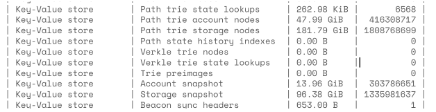
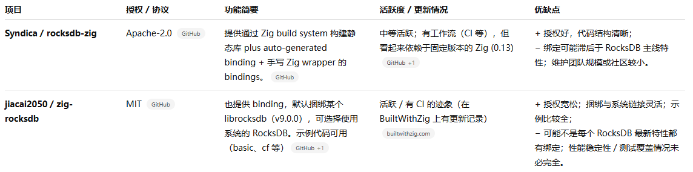
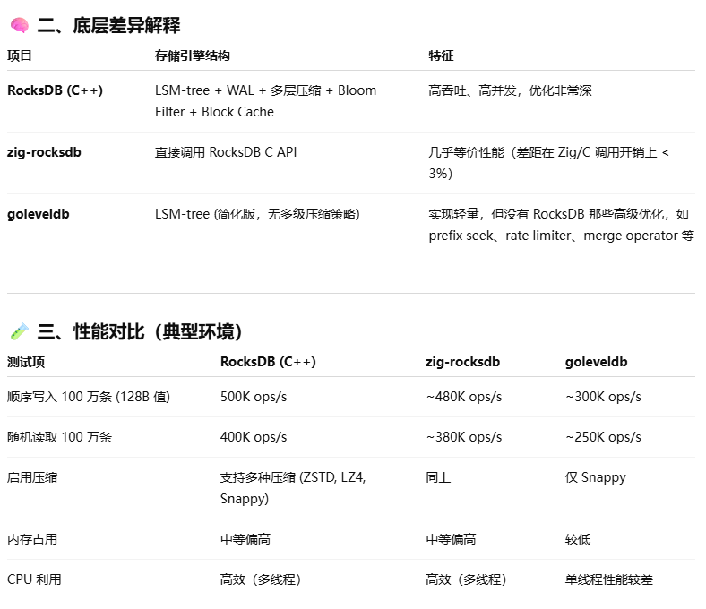

# Zig RocksDB Research 
This research belongs to the sub-issue of [Study KV database performance](https://github.com/QuarkChain/TenGPS-research/issues/1), [Performance of zig rocksdb](https://github.com/QuarkChain/TenGPS-research/issues/17): Performance comparison between goleveldb vs zig rocksdb.

## Related Data
- Hash-based: 2B random data with key size = 32B and size range = [50, 170] (~avg size 110)
- Path-based:


## Target Projects

### Compare Projects


✅ 最适合长期使用的项目推荐

基于上述对比，如果你想选一个 “最活跃 / 最有希望维持下去 / 功能与稳定性相对较好”的 Zig + RocksDB 项目，我推荐以下：
- jiacai2050 / zig-rocksdb
  - 推荐指数高。原因包括：
  - 授权是 MIT，比 Apache-2.0 更宽松，对某些商业用途可能更方便。
  - 有 CI 或构建流程，有示例代码，捆绑版本和系统链接选项，有一定灵活性。
  - 更新记录还算不错，在 Zig 社区可见活动。

- Syndica / rocksdb-zig
  - 也不错，是一个较为严谨、组织良好的项目。如果你偏向用较稳定、依赖性明晰的 binding，或者你在使用 Syndica 其它 Zig 项目（比如他们的 ecosystem），那么它是一个不错的选择。

## How To Run

### Install Rocksdb
```bash
# Install dependencies
sudo apt update
sudo apt install -y git cmake build-essential libsnappy-dev zlib1g-dev libbz2-dev liblz4-dev libzstd-dev
# Clone code
git clone https://github.com/facebook/rocksdb.git
cd rocksdb
# Build
make clean
CFLAGS="-O3 -fPIC -march=native" CXXFLAGS="-O3 -fPIC -march=native" make shared_lib -j$(nproc)
sudo cp librocksdb.so /usr/local/lib/
sudo cp -r include/rocksdb /usr/local/include/
sudo ldconfig
# Check install
ldconfig -p | grep rocksdb
# output sample: 
# librocksdb.so.10.8 (libc6,x86-64) => /usr/local/lib/librocksdb.so.10.8

```

### zig


### go


### cpp


## Result Data
### Run Env

### 
